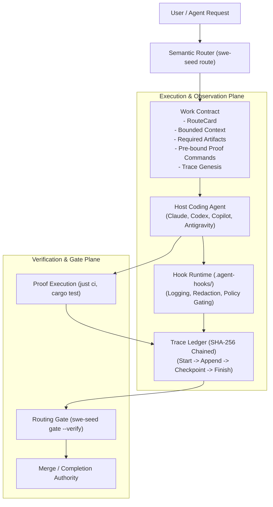

# SWE_SEED Technical Knowledge System

Welcome to the technical documentation system for SWE_SEED. This repository functions as a self-contained, proof-gated engineering environment. This documentation is organized as an interconnected technical knowledge system designed to serve newcomers seeking quick orientation as well as experienced engineers needing architectural depth, exact source references, invariants, and operational runbooks.

---

## 1. What This Project Is

SWE_SEED is a single-binary CLI harness and capability governance layer written in Rust (`swe-seed`). It translates AI coding-agent requests into pre-declared, verifiable work contracts. 

Before execution starts, SWE_SEED binds five explicit dimensions to every task:
1. **Route**: A deterministic work pattern matched to the task type.
2. **Bounded Context**: An explicit set of files required for the task, preventing context poisoning and prompt flooding.
3. **Required Artifacts**: Concrete outputs (diffs, test cases, root cause analyses) that must be produced.
4. **Proof Commands**: Pre-declared verification commands (`just ci`, `cargo test`, `swe-seed eval`) that must pass before completion can be claimed.
5. **Trace**: A tamper-evident cryptographic log recording the genesis, lifecycle events, and completion claims.

SWE_SEED operates locally on repository files (`.agent-harness/`, `.agent-hooks/`, `.swe-seed/`, `.fabricator/`). It runs without external daemons and requires no network connectivity for local operation. It does not invoke an LLM at runtime; contracts are consumed purely as structured data.

---

## 2. What Problem It Solves

AI coding agents make code generation inexpensive, but verification remains expensive. In standard agent workflows:
- Agents choose their own tests after code is written, grading their own work and skipping difficult checks.
- Agents consume unbounded repository context or miss critical constraints.
- A task is considered done simply when the agent outputs a conversational completion summary ("I fixed it"), regardless of whether tests passed or code was modified.
- Multi-host environments (Claude, Codex, GitHub Copilot, Antigravity) diverge because instructions drift across scattered configuration files.
- Failures vanish when chat sessions end, leaving no durable trace for post-mortem analysis or continuous improvement.

SWE_SEED addresses this by shifting proof and constraints from post-summary forensics to pre-execution contracts. A claim of completion has no standing unless verified against pre-bound proof gates and an unbroken trace chain.

---

## 3. The System in One Picture



### What to Notice in this Diagram
- Execution cannot bypass routing: the work contract is generated before the agent modifies source files.
- The trace records events continuously during execution.
- The gate checks the trace chain cryptographically before any completion or merge is permitted.

### What This Diagram Omits
This diagram omits the three-layer governance hierarchy (SweSeed -> Harness -> Fabricator), host configuration projection engines, and the external SEA-Loop federation interface. These details appear in subsequent architectural layers.

---

## 4. The 8 Concepts You Need First

1. **RouteCard**: A structured JSON declaration defining the work pattern for one of 11 required job types. It declares the work loop, required context, expected artifacts, and default proof commands.
2. **Work Contract**: The immutable agreement established before execution begins, binding the route, context pack, artifact requirements, proof commands, and initial trace genesis.
3. **Trace**: An append-only JSON event record stored under `.agent-harness/traces/records/` and indexed into an SQLite ledger, linked by cryptographic SHA-256 hashes.
4. **Bounded Context**: A filtered pack of documents and files assembled per task to satisfy the route card while honoring the context budget policy.
5. **Proof Gate**: A command or test suite bound to the task before execution. Completion claims are invalid without clean exit codes from all pre-bound proof commands.
6. **Host Projection**: The deterministic rendering of canonical harness policies, rules, and skills into host-native tool files (such as `.claude/settings.json`, `.github/copilot-instructions.md`, or Antigravity rules) using managed block delimiters.
7. **Three-Layer Stack**: The strict downward governance architecture consisting of SweSeed (outer governance and capability registry), Harness (middle runtime, routing, and proof), and Fabricator (inner product-to-prototype pipeline).
8. **Contracts-as-Data**: The design principle where BAML schemas (`.baml`) define data contracts without requiring an LLM runtime inside the harness core.

---

## 5. A Representative Journey: Running a Bugfix

Consider an engineer or agent addressing a regression:

1. **Routing**:
   ```bash
   just harness-route "fix the failing checkout test"
   ```
   The router parses the intent, selects `.agent-harness/routes/bugfix.json`, and emits the required context files, required artifacts (reproduction script, root cause note), and proof command (`just ci`).

2. **Context Intake**:
   ```bash
   just harness-context-plan "fix the failing checkout test"
   ```
   SWE_SEED inspects the route obligations and outputs the bounded list of files to read, avoiding full-repository scanning.

3. **Starting the Trace**:
   ```bash
   just harness-trace-start "fix the failing checkout test"
   ```
   A new trace record is initialized with a `RouteSelected` genesis entry and written to `.agent-harness/traces/records/<trace-id>.json`.

4. **Making the Change**:
   The engineer or host agent follows the route card's work loop: reproduces the bug, identifies the root cause, and applies the targeted fix.

5. **Executing Proof and Closing Trace**:
   ```bash
   just harness-trace-finish <trace-id> "repaired checkout race condition" "just ci" "pass"
   ```
   SWE_SEED verifies the proof output and records the final claim and evidence in the trace.

6. **Gate Verification**:
   ```bash
   swe-seed gate <trace-id> --verify
   ```
   The gate validates that the trace originated from a valid route selection, confirms that all SHA-256 hashes in the event chain match, and exits zero.

---

## 6. Navigation by Reader Intent

### I want to run or adopt SWE_SEED
- [Getting Started](getting-started.md): Installation, environment bootstrap, and health checks.
- [First Routed Task Tutorial](tutorials/first-routed-task.md): Hands-on walkthrough of a complete routed task.
- [CLI Reference](reference/cli.md): Full documentation of all `swe-seed` commands and flags.

### I want to understand the architecture and design
- [System Mental Model](mental-model.md): Conceptual model, sovereign loop, and state ownership.
- [Architecture Guide](architecture.md): Logical, runtime, dependency, data flow, control flow, and security models.
- [Domain & Concept Guide](concepts.md): Formal definitions of all repository terms.
- [Design Explanations](explanations/): Architectural rationale for contracts-as-data, pre-execution proof, and three-layer separation.

### I want to explore specific subsystems
- [SweSeed Governance](subsystems/sweseed-governance.md): Capability registry, boundary validation, and provenance.
- [Routing Engine](subsystems/routing-engine.md): Semantic routing and route card mechanics.
- [Context Budget Plane](subsystems/context-budget.md): Bounded context packs and containment policies.
- [Trace Ledger & Gate](subsystems/trace-ledger.md): Cryptographic trace lifecycle and merge gates.
- [Host Adapters & Projection](subsystems/host-adapters-and-projection.md): Multi-host sync, drift detection, and rollback.
- [Hook Runtime](subsystems/hook-runtime.md): Event interception, redaction, and telemetry export.
- [MCPGate Gateway](subsystems/mcpgateway.md): MCP tool catalog discovery, namespacing, and governance.
- [Fabricator Semantic Chain](subsystems/fabricator-semantic-chain.md): Product-to-prototype specification chain.
- [Federation](subsystems/federation.md): SEA-Loop envelope exchange, Ed25519 signing, and SOPS keys.
- [Doctor & Drift Detection](subsystems/doctor-and-drift.md): Aggregate verification and drift scanning.

### I want to perform a task or make a change
- [How-To Guides](howto/): Practical guides for adding route cards, implementing host adapters, configuring MCP servers, and managing federation keys.
- [Building a Prototype with Fabricator](tutorials/building-a-prototype-with-fabricator.md): Bounded product specification and prototype generation.
- [Authoring a Skill](tutorials/authoring-a-new-skill.md): Normalizing and rendering skills to host targets.

### I am debugging an issue
- [Troubleshooting Guide](troubleshooting.md): Diagnosis, error codes, and recovery procedures for common failures.
- [Debugging Routing](howto/debug-routing-mismatches.md): Resolving router misclassifications.

### I need source code traceability
- [Source Map](source-map.md): Matrix mapping architectural concepts to concrete Rust source files, BAML schemas, and tests.
- [Documentation Map](documentation-map.md): Meta-catalog of every documentation file in the repository.
