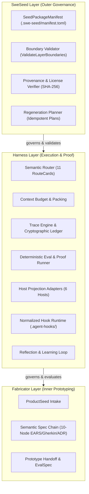
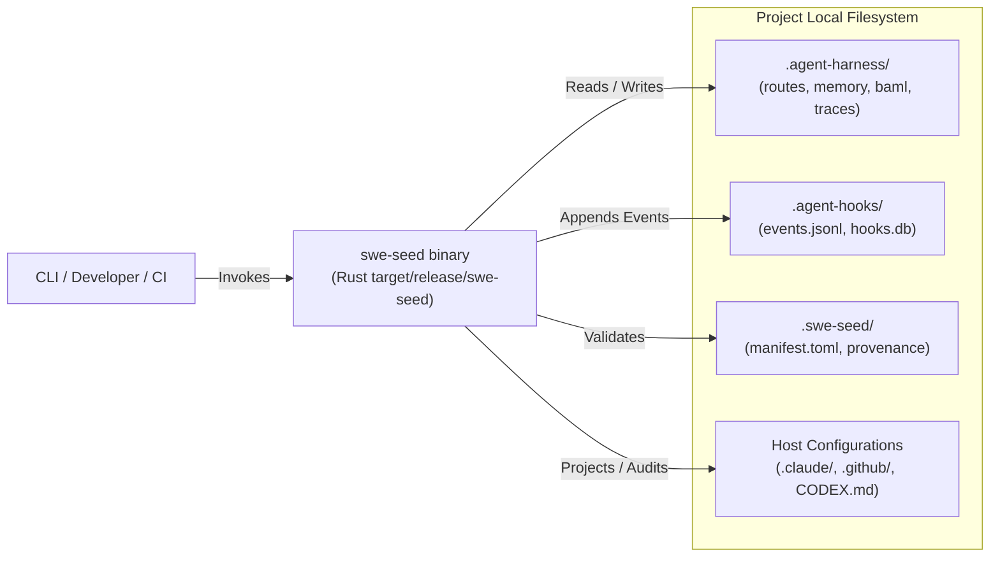
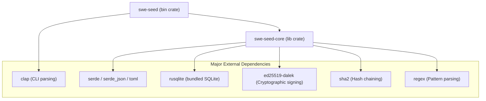
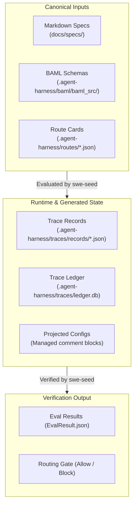
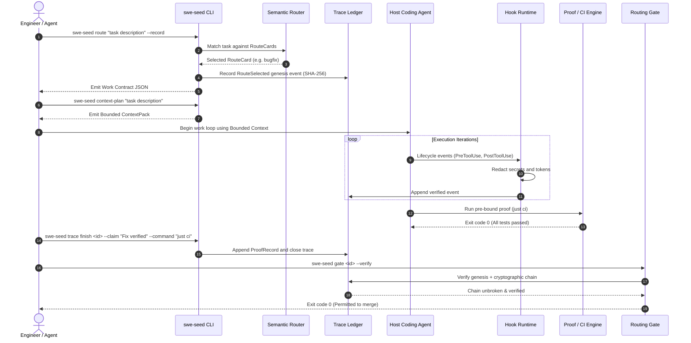
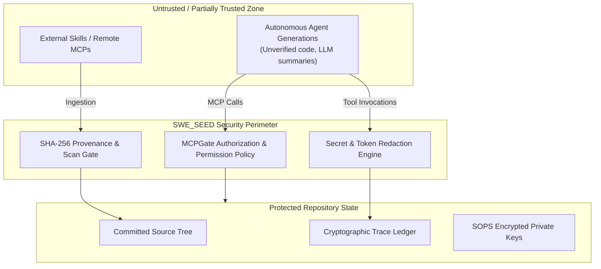

# Architecture Guide

This document presents the canonical architectural model for SWE_SEED. It covers the system across six distinct architectural views: logical, runtime, dependency, data, control flow, and security/trust boundaries.

---

## 1. Logical Architecture

The system is organized into three strictly governed layers, where authority and ownership flow downward only.

### What to Notice in this Diagram
- **Downward Governance**: SweSeed governs Harness; Harness governs Fabricator. An inner layer cannot govern an outer layer concern.
- **Clear Separation**: Outer layers handle governance and cross-host integration; middle layers handle routing, proof, and execution integrity; inner layers handle product-to-prototype synthesis.

### What This Diagram Omits
This diagram omits physical file paths, runtime processes, and external network services (which are covered in subsequent views).

---

## 2. Runtime Architecture

SWE_SEED is architected as a **single-binary, file-first, local-first system**.

### Key Runtime Characteristics
- **No Background Daemon**: SWE_SEED does not require a background daemon, long-running service, or local server for core workflows.
- **Fast Execution**: Written in Rust, commands execute in milliseconds, allowing integration into pre-commit hooks and interactive shell sessions.
- **SQLite Ledgers**: High-throughput event indexing and cryptographic hash validation utilize embedded SQLite 3 databases (`ledger.db`, `hooks.db`) without external database servers.

---

## 3. Dependency Architecture

### Crate Structure
The codebase is structured as a Cargo workspace with two members:
- **`swe-seed` (`crates/swe-seed`)**: The binary CLI crate. It owns argument parsing (`clap`), CLI dispatch, terminal formatting, and top-level exit code resolution.
- **`swe-seed-core` (`crates/swe-seed-core`)**: The core library crate. It owns all domain logic, BAML parsing, cryptographic verification, routing algorithms, host adapters, and trace management.

### Invariants:
1. `swe-seed-core` contains zero CLI presentation logic; it is fully testable as a standalone library.
2. No LLM runtime libraries exist in either crate. All contract interactions occur through deserialization of BAML schemas (`contracts-as-data`).

---

## 4. Data Architecture

SWE_SEED treats repository files as the canonical source of truth:

### Data Lifecycles:
- **Canonical Schemas**: Immutable during execution; updated only through RFCs and versioned Git commits.
- **Trace Records**: Append-only. Every transition produces a new immutable record or state append.
- **Hash Chains**: Each event in `ledger.db` contains `sha256(previous_hash + current_event_payload)`. Altering any historical event invalidates the ledger.
- **Projected Blocks**: Re-derived idempotently via `swe-seed sync`.

---

## 5. Control Flow: The End-to-End Task Lifecycle

The following sequence illustrates the control flow when executing a task under SWE_SEED governance:

---

## 6. Trust and Security Boundaries

SWE_SEED operates under explicit security boundaries:

### Security Principles:
1. **No Secrets in State**: Hook and trace runtimes scrub API keys, bearer tokens, and credentials before writing records to disk.
2. **Fail-Closed Gates**: If a trace ledger is missing, corrupted, or lacks a routing genesis, `swe-seed gate` fails closed with an exit code of 1, blocking merges.
3. **Encrypted Keys at Rest**: Ed25519 federation keys in `.swe-seed/federation/keys/` are encrypted using SOPS and age.
4. **Clean-Room Boundaries**: External skills must pass structural scan gates before registration into the manifest.

---

## Source Trail

- `crates/swe-seed/src/main.rs`: Entry point and process exit code mapping.
- `crates/swe-seed/src/cli.rs`: Top-level CLI command definitions and dispatching.
- `crates/swe-seed-core/src/route/mod.rs`: Semantic router and work contract generation.
- `crates/swe-seed-core/src/trace_ledger.rs`: SHA-256 hash chaining and SQLite ledger persistence.
- `crates/swe-seed-core/src/routing_gate.rs`: `route_gate` enforcement logic.
- `crates/swe-seed-core/src/adapters/`: Multi-host projection adapters and marker block engine.
- `crates/swe-seed-core/src/hooks/runtime.rs`: Hook event interception and secret redaction.
- `crates/swe-seed-core/src/gateway/serve.rs`: MCPGate JSON-RPC 2.0 proxy and policy engine.
- `.agent-harness/baml/baml_src/`: Canonical schema definitions (`swe_seed.baml`, `harness.baml`, `fabricator.baml`).
