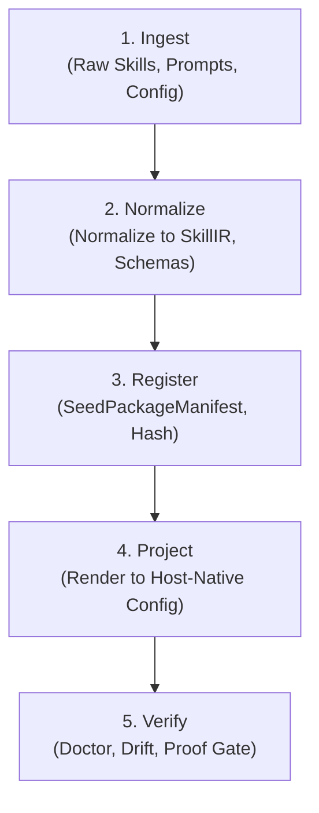

# System Mental Model

This document outlines the core mental model behind SWE_SEED. It explains the system's conceptual structure, responsibilities, boundaries, and operational loops without drowning the reader in implementation trivia.

---

## 1. The Core Problem: The Proof Deficit

AI coding agents have inverted the economics of software development:
- **Code generation is cheap.** An agent can draft hundreds of lines of code in seconds.
- **Verification remains expensive.** Verifying that generated code meets requirements, honors system invariants, preserves backward compatibility, and passes all edge cases requires deep scrutiny.

In unassisted agent workflows, the verification burden shifts entirely onto human reviewers during forensic diff analysis. The agent chooses its own tests after the fact, grading its own homework. Unchecked agents frequently assert completion while skipping tests, dropping edge cases, or hallucinating passing results.

SWE_SEED establishes an invariant: **Claims have no standing without pre-declared proof and an unbroken trace chain.**

---

## 2. The 3-Layer Governance Stack

SWE_SEED organizes its capabilities into three distinct layers, governed strictly from outer to inner:

```
+-------------------------------------------------------------------+
|                           SweSeed Layer                           |
|       Outer Governance, Capability Registry, Layer Boundaries      |
+---------------------------------+---------------------------------+
                                  | governs
                                  v
+-------------------------------------------------------------------+
|                           Harness Layer                           |
|           Routing, Proof, Context Budget, Hooks, Traces           |
+---------------------------------+---------------------------------+
                                  | governs
                                  v
+-------------------------------------------------------------------+
|                         Fabricator Layer                          |
|             Product Need to Prototype Semantic Chain              |
+-------------------------------------------------------------------+
```

### Layer Ownership Rules
1. **Ownership flows downward only**: An inner layer never owns or governs an outer layer's concern.
2. **Cross-layer references point downward**: Outer layers reference inner layer abstractions; inner layers remain unaware of outer layers.
3. **Layer Definitions**:
   - **SweSeed (`SWE_SEED_SPEC_v0.2.0.md`)**: Outer governance. Owns `ProjectSeed`, `LayerCapability`, `SeedPackageManifest`, `BoundaryReport`, and `ArtifactMetadata`. Assembles registered capabilities and verifies layer boundaries.
   - **Harness (`HARNESS_SPEC.md`)**: Middle runtime. Owns `RouteCard`, `SkillIR`, `EvalSpec`, `ProofRecord`, `ContextBudget`, `HookPolicy`, `TraceSchema`, and the learning loop. Turns a task into routed, proven work.
   - **Fabricator (`FABRICATOR_SPEC_v0.1.0.md`)**: Inner prototyping engine. Owns the 10-node semantic chain (`ProductSeed` to `FabricatorProofRecord`) for transforming product needs into bounded prototypes.

---

## 3. The Work Contract

Before any file in the repository is modified, SWE_SEED binds five immutable dimensions into a **Work Contract**:


1. **Route**: A deterministic work pattern matched to the user's intent from the 11 standardized job types (`bugfix`, `implementation`, `refactor`, `test`, `review`, `spec`, `research`, `release`, `documentation`, `harness_improvement`, `skill_authoring`).
2. **Bounded Context**: An explicit, minimal list of files required for the task. The agent is directed to these files and barred from unnecessary repository-wide scanning.
3. **Required Artifacts**: Concrete deliverables demanded by the route (e.g. reproduction script, root cause note, unit test, patch).
4. **Pre-Bound Proof**: Commands declared up front (such as `just ci` or `swe-seed eval run --spec <spec>`) that must execute and pass. Proof cannot be adjusted or simplified after the diff exists.
5. **Cryptographic Trace**: A JSON event record linked by SHA-256 hashes, anchored by a `RouteSelected` genesis event. Work cannot merge without this verified ledger.

---

## 4. The Sovereign Inner Loop

At the repository level, capabilities follow the **Sovereign Inner Loop**:



1. **Ingest**: Import raw skills, policies, or commands from external sources or repository paths.
2. **Normalize**: Convert incoming artifacts into canonical intermediate representations (such as `SkillIR` defined in `harness.baml`).
3. **Register**: Add capabilities into the `SeedPackageManifest` under `.swe-seed/`, accompanied by SHA-256 provenance hashes and license metadata.
4. **Project**: Render canonical skills, rules, and hooks into host-native tool files (such as `.claude/settings.json`, `.github/copilot-instructions.md`, or Antigravity rules) using managed block delimiters.
5. **Verify**: Use `swe-seed doctor` and `swe-seed gate` to detect drift between canonical specs and projected host files.

---

## 5. Contracts-as-Data

A cornerstone architectural principle of SWE_SEED is **Contracts-as-Data**:
- The schema contracts for all three layers are written in BAML (`.baml`) under `.agent-harness/baml/baml_src/`:
  - `swe_seed.baml`
  - `harness.baml`
  - `fabricator.baml`
- **Zero LLM Runtime Dependency**: SWE_SEED does not execute language models to evaluate or parse these contracts. The Rust binary (`swe-seed`) parses and serializes them purely as structured, deterministic data structures (`serde` / `serde_json`).
- This eliminates non-deterministic parsing bugs, hallucinations, network latency, and API key dependencies within the core harness engine.

---

## 6. State Ownership and Storage Topology

SWE_SEED enforces a **file-first, local-first** state architecture:

| State Category | Canonical Storage Location | Format | Mutability | Ownership |
|---|---|---|---|---|
| **Layer Specs** | `docs/specs/`, root spec files | Markdown (`.md`) | Version-controlled | Human maintainers / RFCs |
| **Layer Schemas** | `.agent-harness/baml/baml_src/` | BAML (`.baml`) | Version-controlled | Schema definitions |
| **Route Cards** | `.agent-harness/routes/` | JSON (`.json`) | Version-controlled | Harness Layer |
| **Active Memory** | `.agent-harness/memory/` | Markdown (`.md`) | Version-controlled | Durable harness memory |
| **Agent Scratch** | `.agents/` | YML / MD | Ephemeral (gitignored) | Active agent handoffs |
| **Traces** | `.agent-harness/traces/records/` | JSON (`.json`) | Append-only | Trace engine / Gate |
| **Trace Ledger** | `.agent-harness/traces/ledger.db` | SQLite 3 | Append-only | Trace engine / Gate |
| **Hook Events** | `.agent-hooks/events.jsonl` | JSONL | Append-only | Hook runtime |
| **Host Projections** | `.claude/`, `.github/`, `.agent-rules/` | Mixed (JSON, MD) | Deterministic generated | Host Adapters |

### Invariants:
1. Canonical harness state lives under `.agent-harness/` and is version-controlled.
2. Host files are secondary projected surfaces; manual edits to managed blocks are detected by `doctor` as drift.
3. `.agents/` is uncommitted scratch memory; it must never be treated as an authoritative source of truth.
4. Traces are append-only. Modifying existing trace records breaks SHA-256 cryptographic chain validation.
