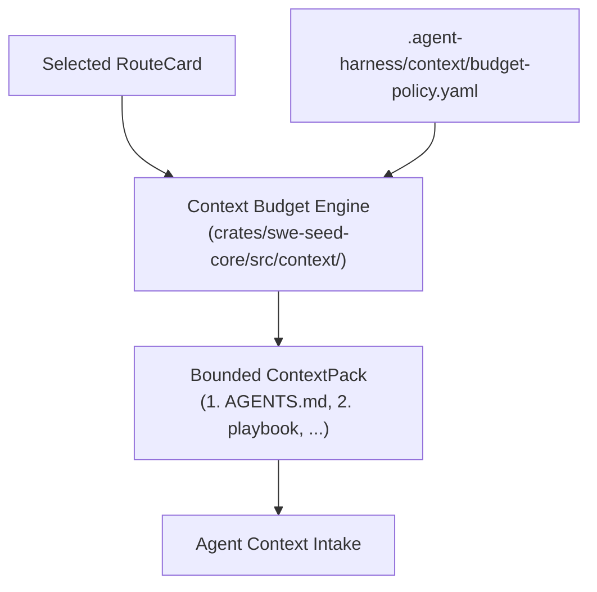
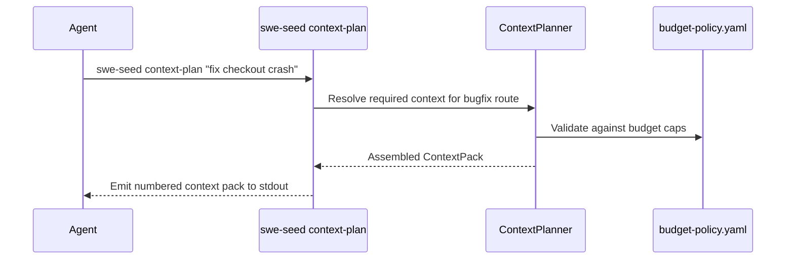

# Context Budget Plane Subsystem

The Context Budget Plane subsystem governs the intake and volume of information loaded into an agent's context window. It ensures that agents receive the precise context demanded by a task without exhausting token limits or introducing distracting irrelevant code.

---

## 1. Purpose

AI coding agents degrade rapidly when flooded with thousands of lines of uncurated repository code or massive command logs. The Context Budget Plane translates the route's `required_context` into an explicit, bounded `ContextPack`, enforcing policies for raw output containment, tool response clipping, and session continuity.

---

## 2. Responsibilities

- **Context Pack Assembly**: Resolving and verifying the file list demanded by the selected RouteCard.
- **Budget Policy Enforcement**: Enforcing rules from `.agent-harness/context/budget-policy.yaml`, such as maximum line limits and token thresholds.
- **Tool Output Containment**: Formatting large outputs into compact summaries, path counts, or focused excerpts rather than raw logs.
- **Session Continuity**: Preserving durable trace records and restart checkpoints so successor agents can resume tasks without reading entire chat transcripts.

---

## 3. Non-Responsibilities

- **Not a Vector Database**: Operates as a deterministic, file-based context planner rather than an ungrounded semantic similarity index.
- **Does Not Fetch Remote Content**: Context planning resolves repository-local paths only.

---

## 4. Position in the System

- **Who calls it**: `swe-seed context-plan "<task>"` and agents following the `AGENTS.md` context discipline contract.
- **What it calls**: Filesystem path resolvers and budget policy parsers.

---

## 5. Core Abstractions

- `ContextPack`: An ordered list of resolved file paths accompanied by byte and token estimates.
- `ContextBudget`: The maximum permissible token or character budget allocated to context intake for a specific task type.
- `BudgetPolicy`: Rules defined in `budget-policy.yaml` specifying `raw_output_policy`, `tool_output_containment`, and `session_continuity`.

---

## 6. Internal Operation

1. When `swe-seed context-plan "<task>"` is called:
   - The task is routed to its corresponding RouteCard.
   - The engine reads `required_context` from the card.
   - Each file path is validated for existence on disk.
   - The engine checks cumulative size against `budget-policy.yaml`.
   - If within budget, it prints the numbered context pack.
   - If any required file is missing, the command fails with a clear diagnostic notice.

---

## 7. State

- **Owned State**: None.
- **Read State**: `.agent-harness/context/budget-policy.yaml`, `.agent-harness/routes/*.json`, target repository files.
- **Modified State**: None.

---

## 8. Lifecycle

---

## 9. Failure Modes

- **Missing Context Target**: A file listed in `required_context` does not exist on disk. `context-plan` alerts the user.
- **Context Flooding**: An agent reads raw build logs or entire directories instead of using containment scripts, violating `AGENTS.md` context discipline.

---

## 10. Extension Points

- **Adjusting Policy Caps**: Modify thresholds in `.agent-harness/context/budget-policy.yaml`.
- **Custom Route Context**: Edit the `required_context` array in any `.agent-harness/routes/<id>.json`.

---

## 11. Source Trail

- `crates/swe-seed-core/src/context/pack.rs`: `ContextPack`, `plan_context()`.
- `crates/swe-seed-core/src/context/budget.rs`: `ContextBudget`.
- `crates/swe-seed-core/src/context/policy.rs`: `BudgetPolicy`.
- `crates/swe-seed/src/context_cli.rs`: CLI subcommand handler.
- `.agent-harness/context/budget-policy.yaml`: Canonical budget configuration.
- `docs/specs/0015-context-budget-plane.md`: Specification.
