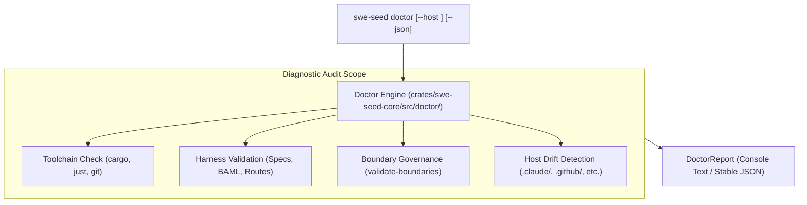
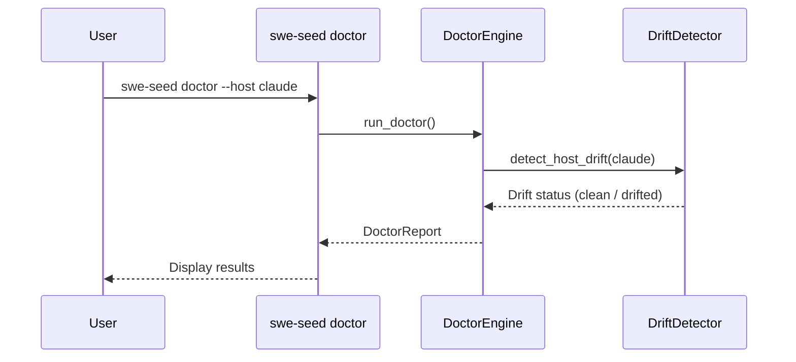

# Doctor & Drift Detection Subsystem

The Doctor & Drift Detection Subsystem aggregates system-wide health checks, audits toolchain availability, verifies layer boundary constraints, and detects configuration drift between canonical specs and projected host files.

---

## 1. Purpose

In distributed multi-host environments, software tools silently drift out of synchronization when users or IDEs modify configuration files directly. Specified in [0008](specs/0008-doctor-and-drift-detection.md), the Doctor subsystem provides a unified diagnostic command (`swe-seed doctor`) that performs comprehensive static, dynamic, and drift audits, ensuring that the repository remains in a known, verified state.

---

## 2. Responsibilities

- **Aggregate Health Checks**: Executing environment, toolchain, harness, and boundary audits in a single command.
- **Host Projection Drift Detection**: Scanning target host files (Claude, Copilot, Codex, Antigravity) to detect unauthorized edits inside managed blocks.
- **Layer Boundary Auditing**: Running `validate_layer_boundaries()` to guarantee layer integrity.
- **Machine-Readable Reports**: Emitting structured JSON reports (`swe-seed doctor --json`) for CI pipelines and automated monitoring.

---

## 3. Non-Responsibilities

- **No Silent Auto-Repair**: Doctor reports drift and health issues; it does not overwrite files without explicit developer commands (`swe-seed sync` or `rollback`).

---

## 4. Position in the System

- **Who calls it**: Developers via `just doctor` and `just harness-doctor`, and CI quality gates.
- **What it calls**: Host adapter drift detectors, boundary validators, and harness structure checkers.

---

## 5. Core Abstractions

- `DoctorCheck`: A single diagnostic inspection returning `Ok`, `Warning(msg)`, or `Error(msg)`.
- `DoctorReport`: The aggregated collection of all check results, with overall status (`Healthy`, `Degraded`, `Failing`).
- `HostDriftReport`: Details file paths, line ranges, and character diffs where projected files diverge from canonical specifications.

---

## 6. Internal Operation

1. **Environment Audit**: Checks whether required commands (`cargo`, `just`, `git`) and recommended commands (`mise`, `pnpm`, `sops`) exist in `$PATH`.
2. **Harness Integrity Audit**: Confirms all root specifications, BAML schemas, and 11 route cards are present and well-formed.
3. **Layer Boundary Audit**: Executes `validate_layer_boundaries()`, checking for illegal cross-layer imports.
4. **Host Drift Audit**: If `--host` is specified (or all hosts by default), compares the content between `<!-- BEGIN SWE_SEED MANAGED BLOCK -->` and `<!-- END SWE_SEED MANAGED BLOCK -->` against a freshly rendered in-memory projection.
5. **Reporting**: Formats findings into plain text or structured JSON.

---

## 7. State

- **Owned State**: None.
- **Read State**: Host runtime files, canonical harness specs, system `$PATH`.
- **Modified State**: None.

---

## 8. Lifecycle

---

## 9. Failure Modes

- **Host Drift Detected**: A developer manually edited a generated file. Resolved by running `swe-seed sync` or `swe-seed rollback`.
- **Missing Required Tool**: A critical binary (e.g. `cargo`) is missing from `$PATH`. Doctor exits non-zero.

---

## 10. Extension Points

- **Registering Custom Checks**: Add new check routines to `crates/swe-seed-core/src/doctor/check.rs`.

---

## 11. Source Trail

- `crates/swe-seed-core/src/doctor/mod.rs`: Doctor orchestrator.
- `crates/swe-seed-core/src/doctor/check.rs`: Individual diagnostic check definitions.
- `crates/swe-seed-core/src/doctor/drift.rs`: `detect_host_drift()` implementation.
- `crates/swe-seed-core/src/doctor/report.rs`: `DoctorReport` serialization.
- `crates/swe-seed/src/doctor_cli.rs`: CLI command handlers.
- `docs/specs/0008-doctor-and-drift-detection.md`: Subsystem specification.
