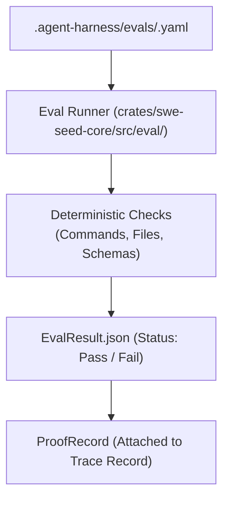
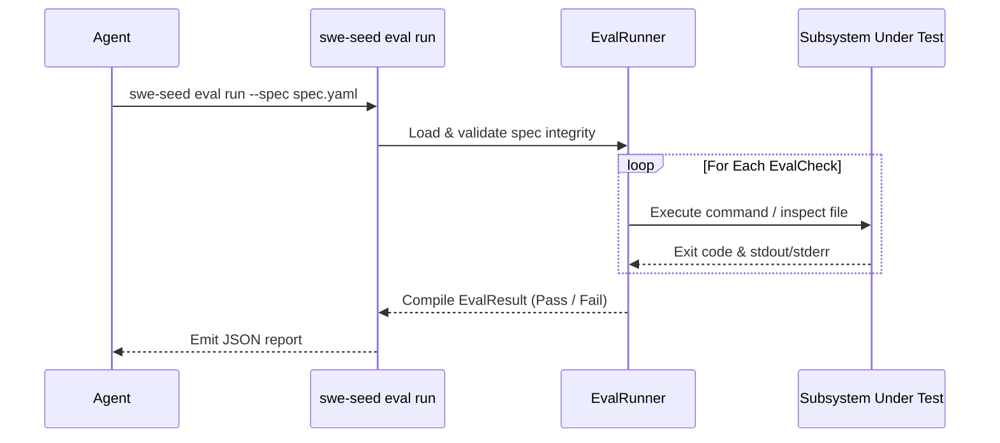

# Eval & Proof Subsystem

The Eval & Proof Subsystem provides deterministic verification of agent claims. It enforces the rule: **Completion is not a statement of effort; completion requires proof.**

---

## 1. Purpose

In conventional agent frameworks, verification is often subjective or left to non-deterministic LLM-as-a-judge evaluators. The Eval & Proof subsystem provides reproducible, deterministic evaluation gates. It guarantees that `EvalSpec` test criteria are frozen prior to handoff and cannot be relaxed after the fact to manufacture passing results.

---

## 2. Responsibilities

- **Deterministic Evaluation**: Executing `EvalSpec` files containing explicit command-based or file-based `EvalCheck` entries.
- **Proof Disposition Tracking**: Binding executed command results to completion claims (`ProofRecord`), assigning dispositions (`Pass`, `Fail`, `Waived`).
- **Frozen Spec Integrity**: Ensuring that once an `EvalSpec` is handed off, its checks cannot be modified during the run.
- **Root Spec Validation**: Verifying that static harness structure rules pass (`swe-seed validate`).

---

## 3. Non-Responsibilities

- **No LLM Evaluators**: Does not invoke language models to grade outputs. Every check executes deterministic scripts, CLI commands, or file assertions.
- **Not a CI Runner**: Does not replace CI; it orchestrates and records CI command results as proof artifacts.

---

## 4. Position in the System

- **Who calls it**: `swe-seed eval run --spec <spec>`, `swe-seed validate`, `just ci`, and the Fabricator product verification pipeline.
- **What it calls**: Child process execution APIs and file inspection routines.

---

## 5. Core Abstractions

- `EvalSpec`: A versioned evaluation contract listing the target task, timeout, environment, and required `EvalCheck` items.
- `EvalCheck`: A specific assertion (e.g. `CommandExitZero`, `FileExists`, `RegexMatch`, `HarnessValidation`).
- `EvalResult`: The outcome of executing an `EvalSpec`, with status `Pass`, `Fail`, or `Error`, alongside detailed check logs.
- `ProofRecord`: The durable record connecting a completion claim to executed commands, exit codes, and stdout/stderr evidence.
- `ProofDisposition`: Enum indicating proof standing: `Accepted`, `Rejected`, `Waived(reason)`.

---

## 6. Internal Operation

1. **Spec Freezing**: When work begins, the hash of the `EvalSpec` is recorded.
2. **Execution**: `swe-seed eval run --spec <path>` reads the spec and executes each check sequentially or in parallel depending on dependency constraints.
3. **Capture**: Standard output and error streams are captured, sanitized, and stored.
4. **Disposition Resolution**:
   - If all checks succeed: `EvalResult.status = Pass`.
   - If any check fails: `EvalResult.status = Fail`.
5. **Promotion Guard**: Per `HARNESS_SPEC.md`, a capability or lesson is promoted only on a live `Pass`. Waived checks require explicit documented justifications.

---

## 7. State

- **Owned State**: None directly.
- **Read State**: `.agent-harness/evals/*.yaml`.
- **Written State**: `EvalResult.json` (or custom output path).

---

## 8. Lifecycle

---

## 9. Failure Modes

- **Spec Tampering**: Modifying an `EvalSpec` after initial handoff. The hash check fails and rejects the run.
- **Waived Check Without Reason**: Attempting to waive a failed check without providing a mandatory justification string.
- **Command Timeout**: An `EvalCheck` command hangs; the runner enforces a timeout cap and marks the check failed.

---

## 10. Extension Points

- **Adding Custom Check Types**: Add variants to `EvalCheckKind` in `crates/swe-seed-core/src/eval/check.rs`.
- **Custom Output Reporters**: Extend `crates/swe-seed/src/eval_cli.rs` to support JUnit or TAP formats.

---

## 11. Source Trail

- `crates/swe-seed-core/src/eval/spec.rs`: `EvalSpec` data structure.
- `crates/swe-seed-core/src/eval/check.rs`: Check execution logic.
- `crates/swe-seed-core/src/eval/result.rs`: Result formatting and serialization.
- `crates/swe-seed-core/src/eval/proof.rs`: `ProofRecord`, `ProofDisposition`.
- `crates/swe-seed/src/eval_cli.rs`: CLI commands for `eval` and `validate`.
- `docs/specs/0013-eval-and-proof.md`: Subsystem specification.
