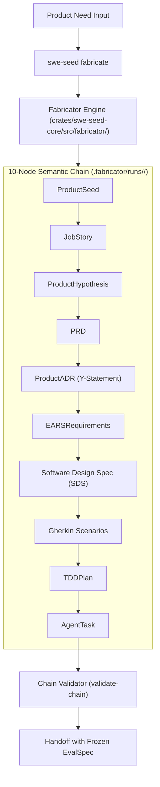
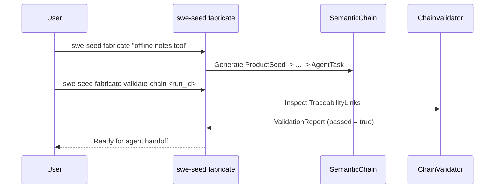

# Fabricator Semantic Chain Subsystem

The Fabricator Subsystem is the innermost layer of SWE_SEED. Specified in [0017](specs/0017-fabricator-layer.md) and `FABRICATOR_SPEC_v0.1.0.md`, it transforms an initial product need into a proven prototype through a strictly validated, 10-node semantic specification chain.

---

## 1. Purpose

When coding agents generate software prototypes directly from vague prompts, the resulting code lacks requirements traceability, architecture documentation, and rigorous verification. The Fabricator layer runs a bounded, single-pass synthesis pipeline that produces a fully traceable chain of design artifacts before handing off an execution task to a coding agent.

---

## 2. Responsibilities

- **Semantic Specification Chain Synthesis**: Deriving and validating the 10-link specification chain:
  ```
  ProductSeed -> JobStory -> ProductHypothesis -> PRD -> ProductADR (Y-statement)
    -> EARSRequirements -> SDS / SDSComponents -> GherkinScenarios -> TDDPlan
    -> AgentTask -> FabricatorEvalSpec -> FabricatorProofRecord
  ```
- **Traceability Link Validation**: Ensuring every downstream artifact explicitly links to its upstream parent via a validated `TraceabilityLink`.
- **Requirements Standardization**: Enforcing EARS syntax (Easy Approach to Requirements Syntax) for requirements and Gherkin syntax (`Given/When/Then`) for behavioral scenarios.
- **Proof-Gated Handoff**: Ensuring that an `AgentTask` hands off to an execution agent only alongside a frozen `FabricatorEvalSpec` and pre-bound regression cases.

---

## 3. Non-Responsibilities

- **Not an Autonomous Infinite Loop**: Does not loop indefinitely trying to build complete systems. It executes one bounded pass from need to prototype, produces proof, and hands off.
- **Does Not Replace the Harness**: Uses the Harness layer's evaluation and proof mechanisms at product scope.

---

## 4. Position in the System



- **Who calls it**: `swe-seed fabricate`, `just fabricate`, and prototype development workflows.
- **What it calls**: BAML template renderers and chain validation algorithms.

---

## 5. Core Abstractions

- `ProductSeed`: The foundational description of target user, problem statement, and constraints.
- `JobStory`: Formatted as: *When [situation], I want to [motivation], so I can [expected outcome]*.
- `ProductADR`: Formatted using the Y-statement pattern: *In the context of [context], facing [concern], we decided for [option], to achieve [benefit], accepting [downside]*.
- `EARSRequirements`: Requirements classified into Ubiquitous, Event-driven, State-driven, Unwanted behavior, or Optional features.
- `TraceabilityLink`: Cryptographic or URI link binding child artifacts to parent artifacts.
- `SemanticChainValidationReport`: Audit result validating unbroken upstream and downstream link continuity.

---

## 6. Internal Operation

1. **Intake**: A product need is provided to `swe-seed fabricate <need>`.
2. **Sequential Generation**: The engine initializes a run under `.fabricator/runs/<run_id>/` and synthesizes each artifact in dependency order.
3. **Traceability Binding**: Each generated file includes YAML metadata referencing the exact parent file and hash.
4. **Validation**: `swe-seed fabricate validate-chain <run_id>` verifies that:
   - All 10 node types exist.
   - All Gherkin scenarios trace back to specific EARS requirements.
   - All EARS requirements trace back to PRD features.
   - If any link is broken, `passed = false` and handoff is blocked.

---

## 7. State

- **Owned State**: `.fabricator/runs/<run_id>/`, `.fabricator/config.yaml`.
- **Read State**: `.fabricator/templates/`, `.agent-harness/baml/baml_src/fabricator.baml`.
- **Modified State**: Creates run directories and specification files.

---

## 8. Lifecycle



---

## 9. Failure Modes

- **Broken Upstream Link**: An artifact fails to cite its parent identifier. Chain validation fails.
- **Malformed Requirement Syntax**: An EARS requirement omits conditional clauses (`When`, `While`, `Where`). Detected during static chain validation.

---

## 10. Extension Points

- **Custom Templates**: Customize artifact generation templates under `.fabricator/templates/`.
- **Domain-Specific Scenarios**: Extend Gherkin scenario generators in `crates/swe-seed-core/src/fabricator/artifacts.rs`.

---

## 11. Source Trail

- `crates/swe-seed-core/src/fabricator/artifacts.rs`: Structs for all 10 semantic chain nodes.
- `crates/swe-seed-core/src/fabricator/chain.rs`: `validate_semantic_chain()`, `SemanticChainValidationReport`.
- `crates/swe-seed-core/src/fabricator/render.rs`: Template rendering engine.
- `crates/swe-seed/src/fabricate_cli.rs`: CLI command handlers.
- `.agent-harness/baml/baml_src/fabricator.baml`: Canonical schema contract.
- `FABRICATOR_SPEC_v0.1.0.md`: Root layer contract.
- `docs/specs/0017-fabricator-layer.md`: Subsystem specification.
