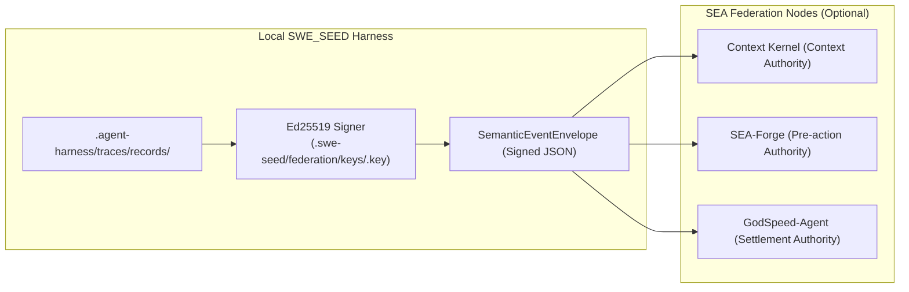
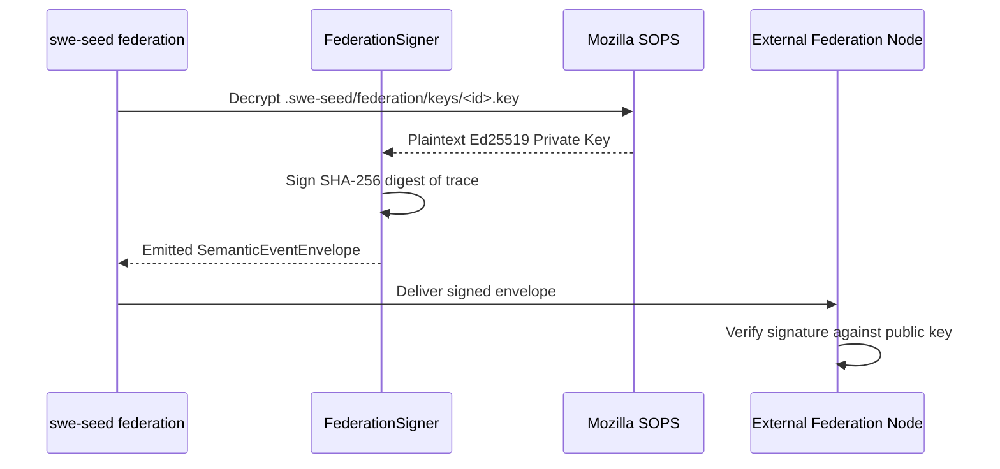

# Federation Subsystem

The Federation Subsystem enables optional integration with the wider SEA (Software Engineering Autonomous) capability loop, supporting signed event envelopes, cryptographic Ed25519 verification, and encrypted key management.

---

## 1. Purpose

In multi-agent ecosystems (Context Kernel, SEA-Forge, GodSpeed-Agent), task state and proof events must be securely exchanged across organizational and system boundaries. Specified in [0011](specs/0011-sea-loop-federation.md), the Federation Subsystem provides tamper-evident envelope exchange while preserving a strict architectural invariant: **The local inner loop always works fully standalone when federation is disabled.**

---

## 2. Responsibilities

- **Semantic Event Envelope I/O**: Emitting and consuming structured `SemanticEventEnvelope` payloads.
- **Cryptographic Signing (Ed25519)**: Signing emitted traces and verification records with repository private keys.
- **Envelope Verification**: Verifying incoming signatures against public keyrings in `.agent-harness/federation/keys/`.
- **SOPS Key Encryption**: Managing Ed25519 private keys encrypted at rest using Mozilla SOPS and age.
- **Autonomous Standalone Fallback**: Guaranteeing that when federation is disabled (`--federation off`), zero external network calls occur.

---

## 3. Non-Responsibilities

- **Not a Mandatory Control Plane**: Standalone SWE_SEED requires no external servers, keys, or federation setup for standard operation.
- **Does Not Settle Outcomes**: SWE_SEED produces signed evidence; external settlement authorities (such as GodSpeed-Agent) decide what the outcome counts for.

---

## 4. Position in the System

- **Who calls it**: `swe-seed federation` subcommands, `swe-seed run --federation on`, and CI signing recipes.
- **What it calls**: `ed25519-dalek` for cryptographic signing and `sops` for key encryption.

---

## 5. Core Abstractions

- `SemanticEventEnvelope`: Standardized wrapper containing `envelope_id`, `source_node`, `timestamp`, `event_type`, `payload`, and `signature`.
- `FederationFlags`: Configuration toggles (`enabled: bool`, `master_switch: off | on`).
- `Ed25519Keypair`: Public/private keypair used for signing traces and envelopes.
- `OperationalSettlement`: The classification payload returned by upstream settlement nodes.

---

## 6. Internal Operation

### 1. Key Generation & Encryption
- An engineer runs `swe-seed federation keygen <key-id>`.
- Generates an Ed25519 keypair.
- Writes the public key to committed `.agent-harness/federation/keys/<key-id>.pub`.
- Writes the private key to gitignored `.swe-seed/federation/keys/<key-id>.key`.
- Encrypts the private key at rest via `just federation-encrypt-key <key-id>` using SOPS and age.

### 2. Envelope Signing
- On task completion, `swe-seed federation sign <trace-id> --key <key-id>` decrypts the private key in memory.
- Computes the SHA-256 digest of the canonical trace record.
- Signs the digest using the Ed25519 private key.
- Wraps the trace and signature into a `SemanticEventEnvelope`.

---

## 7. State

- **Owned State**:
  - `.swe-seed/federation/keys/`: Private keys (gitignored, SOPS encrypted).
  - `.agent-harness/federation/keys/`: Public keys (committed).
- **Read State**: Trace records, federation configuration.
- **Modified State**: Emits signed envelope files.

---

## 8. Lifecycle

---

## 9. Failure Modes

- **Unencrypted Private Key**: A private key is left unencrypted on disk. Detected by `swe-seed doctor` as a security boundary violation.
- **Signature Mismatch**: Modifying an envelope payload after signing causes signature verification to fail immediately.

---

## 10. Extension Points

- **Adding Federation Producers/Consumers**: Extend `crates/swe-seed-core/src/federation/producers.rs` and `consume.rs`.

---

## 11. Source Trail

- `crates/swe-seed-core/src/federation/envelope.rs`: `SemanticEventEnvelope` schema.
- `crates/swe-seed-core/src/federation/signing.rs`: Keygen, signing, and verification.
- `crates/swe-seed-core/src/federation/flags.rs`: Federation feature flags.
- `crates/swe-seed/src/federation_cli.rs`: CLI commands (`status`, `sign`, `verify`).
- `docs/specs/0011-sea-loop-federation.md`: Subsystem specification.
- `justfile`: `federation-encrypt-key`, `federation-decrypt-key` recipes.
