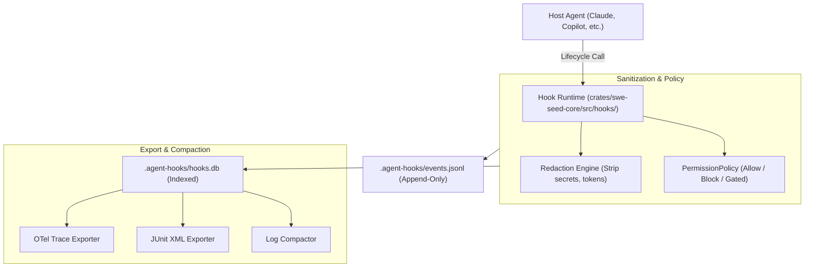
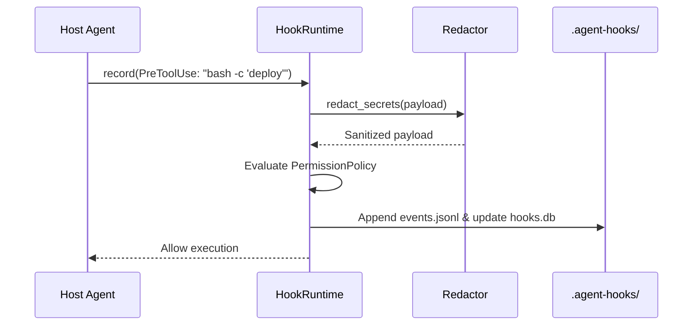

# Hook Runtime Subsystem

The Hook Runtime Subsystem intercepts, normalizes, and records agent lifecycle events, enforces permission policies, redacts sensitive secrets, and exports execution telemetry to standard industry formats.

---

## 1. Purpose

When coding agents execute tool calls or process prompts, actions must be captured for forensic review without leaking credentials into logs. The Hook Runtime establishes a standardized lifecycle interface across heterogeneous host agents. It sanitizes event streams in flight and maintains an append-only, queryable audit trail.

---

## 2. Responsibilities

- **Lifecycle Event Interception**: Handling standard events (`UserPrompt`, `PreToolUse`, `PostToolUse`, `TurnEnd`, `Error`).
- **Secret & Token Redaction**: Stripping API keys, OAuth tokens, and sensitive headers from arguments and logs prior to disk writes.
- **Durable Event Logging**: Appending JSONL records to `.agent-hooks/events.jsonl`.
- **SQLite Indexing**: Indexing event payloads into `.agent-hooks/hooks.db` for low-latency queries.
- **Telemetry Export**: Exporting captured logs to OpenTelemetry (OTel) traces and JUnit XML reports.
- **Log Compaction**: Compacting historical logs (`swe-seed agent-hooks compact-logs`) to manage disk space.

---

## 3. Non-Responsibilities

- **Not an OS Sandbox**: Does not provide kernel-level cgroups or hardware virtualization; policy checks occur at the tool-invocation boundary.
- **Does Not Grade Code**: Logging captures what happened, not whether code quality is aesthetically pleasing.

---

## 4. Position in the System

- **Who calls it**: Host agent lifecycle scripts, tool wrappers, and `swe-seed agent-hooks` subcommands.
- **What it calls**: SQLite (`rusqlite`) and filesystem append APIs.

---

## 5. Core Abstractions

- `AgentEvent`: Enum representing lifecycle milestones (`UserPrompt`, `PreToolUse`, `PostToolUse`, `TurnEnd`).
- `HookPolicy` / `PermissionPolicy`: Rules defining permitted, blocked, or approval-gated tool actions.
- `HookRuntime`: The central orchestrator managing event ingestion, redaction, and persistence.
- `redact_secrets()`: Regex-driven filter scrubbing sensitive patterns (AWS keys, GitHub tokens, Bearer tokens).

---

## 6. Internal Operation

1. **Receipt**: An event payload arrives via CLI (`swe-seed agent-hooks record`) or direct library call.
2. **Redaction**: The payload passes through `redact_secrets()`, replacing detected secret patterns with `[REDACTED]`.
3. **Policy Evaluation**: If the event is `PreToolUse`, it is evaluated against `PermissionPolicy`:
   - `Allow`: Proceeds to execution.
   - `Block`: Exits non-zero with an explanatory error.
   - `ApprovalGated`: Halts until human or system confirmation is recorded.
4. **Persistence**: The sanitized event is written to `.agent-hooks/events.jsonl` and inserted into `.agent-hooks/hooks.db`.

---

## 7. State

- **Owned State**: `.agent-hooks/events.jsonl`, `.agent-hooks/hooks.db`.
- **Read State**: `.agent-harness/config.yaml` (hook and permission policies).
- **Modified State**: Appends event records.

---

## 8. Lifecycle

---

## 9. Failure Modes

- **Uncaught Secret Pattern**: An unconventional token format bypasses default regexes. Mitigated by updating regex patterns in `crates/swe-seed-core/src/hooks/redact.rs`.
- **Database Lock**: Multiple concurrent processes access SQLite simultaneously. Resolved via short retry timeouts with exponential backoff.

---

## 10. Extension Points

- **Adding Exporters**: Implement new format serializers in `crates/swe-seed-core/src/hooks/export.rs`.
- **Custom Redaction Patterns**: Add regex rules to `DEFAULT_PATTERNS` in `crates/swe-seed-core/src/hooks/redact.rs`.

---

## 11. Source Trail

- `crates/swe-seed-core/src/hooks/runtime.rs`: `HookRuntime` engine.
- `crates/swe-seed-core/src/hooks/events.rs`: `AgentEvent` definitions.
- `crates/swe-seed-core/src/hooks/policy.rs`: `HookPolicy`, `PermissionPolicy`.
- `crates/swe-seed-core/src/hooks/redact.rs`: Secret redaction engine.
- `crates/swe-seed-core/src/hooks/export.rs`: OTel and JUnit telemetry exporters.
- `crates/swe-seed/src/hooks_cli.rs`: CLI command handlers.
- `docs/specs/0005-normalized-hook-runtime.md`: Specification.
