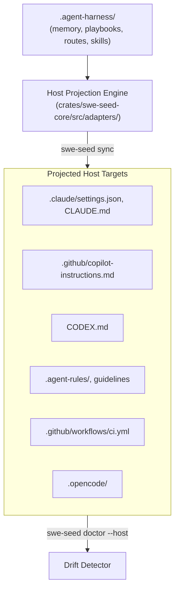
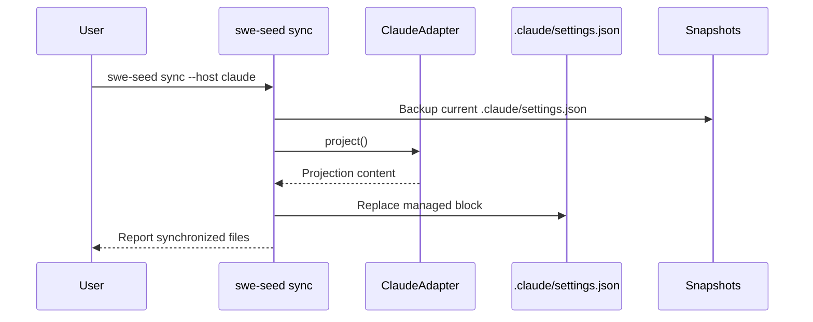

# Host Adapters & Projection Subsystem

The Host Adapters & Projection Subsystem projects canonical SWE_SEED doctrine, rules, skills, and hooks into host-native tool files across multiple AI coding assistants, detecting drift and supporting instant rollback.

---

## 1. Purpose

Different AI coding tools use different configuration formats: Claude Code uses `.claude/settings.json` and `CLAUDE.md`, GitHub Copilot uses `.github/copilot-instructions.md`, Codex uses `CODEX.md`, and Antigravity uses `.agent-rules/` and guidelines. Without centralized projection, instructions drift across files. This subsystem makes the canonical `.agent-harness/` specifications the single source of truth, compiling and projecting them into host tools deterministically.

---

## 2. Responsibilities

- **Host Configuration Projection**: Rendering canonical skills, rules, and hook policies into host-native files using `swe-seed sync --host <host>`.
- **Managed Block Delimitation**: Updating only regions bounded by `<!-- BEGIN SWE_SEED MANAGED BLOCK -->` and `<!-- END SWE_SEED MANAGED BLOCK -->`, preserving user customization outside the markers.
- **Drift Detection**: Auditing projected files against canonical source definitions via `swe-seed doctor --host <host>` to detect manual, out-of-band edits.
- **Snapshot Rollback**: Automatically snapshotting host files before modification to enable one-command recovery via `swe-seed rollback --host <host>`.
- **Capability Matrix Reporting**: Documenting the honest enforcement strength (`Strict`, `Advisory`, or `Unsupported`) for each host via `swe-seed hosts`.

---

## 3. Non-Responsibilities

- **Not an Agent Wrapper**: Does not proxy or wrap the agent's executable binary. Host tools interact directly with their native files.
- **No False Enforcement Claims**: Does not pretend advisory prompts provide pre-action blocking when a host lacks tool-call interception hooks.

---

## 4. Position in the System

- **Who calls it**: `swe-seed sync`, `swe-seed rollback`, `swe-seed hosts`, and `swe-seed doctor`.
- **What it calls**: Host adapter implementations and template rendering routines.

---

## 5. Core Abstractions

- `HostAdapter` (Trait): Interface defining `project()`, `detect_drift()`, `capability_matrix()`, and `target_files()`.
- `Projection`: The rendered file bundle with target relative path and replacement content.
- `HostCapabilityMatrix`: Struct detailing whether a host supports pre-prompt routing, pre-tool safety blocking, post-tool logging, and token budgeting.
- `replace_managed_block()`: String manipulation function replacing delimited managed blocks while preserving user edits.

---

## 6. Internal Operation

### The Sync Lifecycle
1. **Snapshot**: Copies current target host files to `.agent-harness/snapshots/<host>/<timestamp>/`.
2. **Render**: Loads canonical specs and renders templates for the selected host adapter.
3. **Marker Delimitation**: Checks whether target files exist:
   - If missing, creates the file containing the managed block markers.
   - If present, searches for the managed block markers and replaces only the bounded content.
4. **Write**: Saves the updated file. If `--dry-run` was specified, prints diffs to stdout without disk writes.

---

## 7. State

- **Owned State**: `.agent-harness/snapshots/<host>/`.
- **Read State**: `.agent-harness/`, `AGENTS.md`, host target files.
- **Modified State**: Host target files (`.claude/`, `.github/`, etc.).

---

## 8. Lifecycle

---

## 9. Failure Modes

- **Managed Marker Missing**: A user manually deletes the managed block comments. `sync` reports an error to avoid accidentally overwriting custom content.
- **Drift Failure**: An out-of-band edit occurred. `swe-seed doctor --host` exits with a drift finding until resolved.

---

## 10. Extension Points

- **Adding a New Host**: Implement the `HostAdapter` trait in a new file under `crates/swe-seed-core/src/adapters/<host>.rs` and register it in `crates/swe-seed-core/src/adapters/mod.rs`.

---

## 11. Source Trail

- `crates/swe-seed-core/src/adapters/mod.rs`: Adapter registry and sync orchestration.
- `crates/swe-seed-core/src/adapters/host.rs`: `HostAdapter` trait definition.
- `crates/swe-seed-core/src/adapters/marker.rs`: Managed block marker parsing.
- `crates/swe-seed-core/src/adapters/claude.rs`: Claude adapter.
- `crates/swe-seed-core/src/adapters/github_copilot.rs`: GitHub Copilot adapter.
- `crates/swe-seed-core/src/adapters/antigravity.rs`: Antigravity adapter.
- `crates/swe-seed/src/host_cli.rs`: CLI command handlers for `sync`, `rollback`, and `hosts`.
- `docs/specs/0004-host-adapter-contract.md`: Specification.
