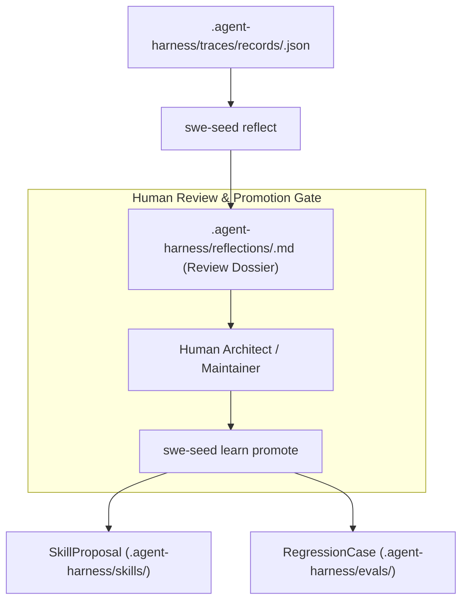
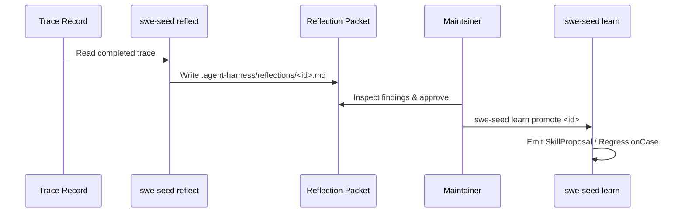

# Learning & Adaptation Subsystem

The Learning & Adaptation Subsystem provides structured mechanisms for post-task reflection, knowledge distillation, and reviewed system improvement without permitting unverified or uncontrolled self-modification.

---

## 1. Purpose

When an agent completes a complex task or encounters an instructive failure, the lessons learned must be captured to prevent repeated errors. However, autonomous agents that silently rewrite their own operating rules introduce drift and instability. This subsystem establishes a governed learning loop: finished traces are reflected into reviewed learning candidates, which require explicit human approval, proof checks, and rollback plans before promotion.

---

## 2. Responsibilities

- **Trace Reflection**: Distilling completed trace records into structured `LearningRecord` candidates using `swe-seed reflect <trace_id>`.
- **Candidate Packaging**: Grouping observed failure patterns, reusable procedures, or missing context into concrete proposals.
- **Controlled Promotion**: Promoting reviewed learning candidates into `SkillProposal` or `RegressionCase` artifacts via `swe-seed learn`.
- **Adaptation Decision Synthesis**: Computing an `AdaptationDecision` from a run's evaluation results via `swe-seed adapt <run_id>`.
- **Safety Governance**: Enforcing that material harness modifications are gated by human review while `learning.auto_apply` remains false.

---

## 3. Non-Responsibilities

- **No Silent Auto-Modification**: Never silently mutates `AGENTS.md` or active route cards without reviewed proof.
- **Not Stochastic Reinforcement Learning**: Operates on explicit symbolic artifacts (specs, skills, test cases) rather than model weights.

---

## 4. Position in the System

- **Who calls it**: Maintainers after significant tasks, and CI post-run reflection hooks.
- **What it calls**: Trace distillation routines and BAML schema validators.

---

## 5. Core Abstractions

- `ReflectionTemplate`: The structured format defining how traces are summarized into findings, surprises, and proposed adaptations.
- `LearningRecord`: A structured entity containing source trace references, observed symptoms, root causes, and suggested improvements.
- `SkillProposal`: A formal proposal to introduce or update a skill, accompanied by risk analysis and a documented rollback plan.
- `RegressionCase`: An automated `EvalCheck` derived from a real failure to prevent regressions.
- `AdaptationDecision`: The aggregate decision document indicating whether proposed changes should be merged, rejected, or revised.

---

## 6. Internal Operation

1. **Reflection**: `swe-seed reflect <trace_id>` reads the target trace record, analyzes events and tool calls, extracts surprises and failure branches, and writes a review packet to `.agent-harness/reflections/`.
2. **Review**: The engineer reviews the reflection dossier, verifying that the proposed lesson is generalizable and not a one-off anomaly.
3. **Promotion**: `swe-seed learn` packages the approved lesson:
   - If procedural: Generates a `SkillProposal` with an explicit rollback procedure.
   - If defect-related: Generates a `RegressionCase` linked to an `EvalCheck`.
4. **Enforcement**: New skills and test cases are verified via `just harness-validate` and `just ci` before being accepted into canonical memory.

---

## 7. State

- **Owned State**: `.agent-harness/reflections/`, `.agent-harness/learning/`.
- **Read State**: `.agent-harness/traces/records/`.
- **Modified State**: Creates proposals and test fixtures.

---

## 8. Lifecycle

---

## 9. Failure Modes

- **Overfitting to One-Off Quirks**: Proposing a skill for an edge case that does not generalize. Prevented by human review requirements.
- **Missing Rollback Plan**: Attempting to create a `SkillProposal` without rollback instructions fails validation.

---

## 10. Extension Points

- **Custom Reflection Heuristics**: Modify extraction rules in `crates/swe-seed-core/src/learning/reflection.rs`.
- **Custom Regression Generators**: Extend `crates/swe-seed-core/src/learning/regression.rs`.

---

## 11. Source Trail

- `crates/swe-seed-core/src/learning/reflection.rs`: Trace reflection and template rendering.
- `crates/swe-seed-core/src/learning/record.rs`: `LearningRecord` schema.
- `crates/swe-seed-core/src/learning/proposal.rs`: `SkillProposal`.
- `crates/swe-seed-core/src/learning/regression.rs`: `RegressionCase`.
- `crates/swe-seed-core/src/learning/adaptation.rs`: `AdaptationDecision`.
- `crates/swe-seed/src/learning_cli.rs`: CLI subcommands (`reflect`, `learn`, `adapt`).
- `docs/specs/0016-learning-and-adaptation-loop.md`: Specification.
