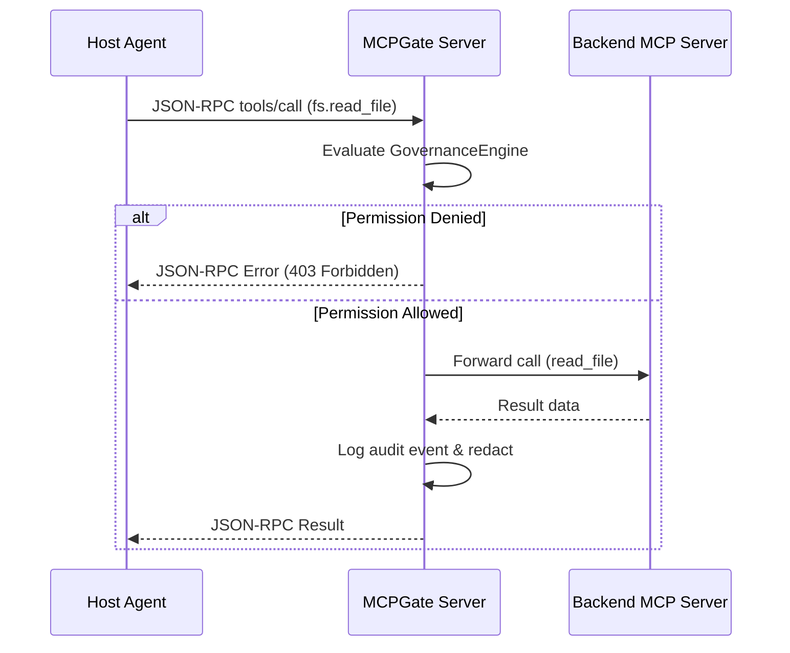

# MCPGate (MCP Gateway) Subsystem

The MCPGate Subsystem manages the capability and tool plane for SWE_SEED. Specified in [0020](specs/0020-mcpgate.md), it virtualizes, namespaces, and governs Model Context Protocol (MCP) servers.

---

## 1. Purpose

AI coding agents increasingly invoke tools via the Model Context Protocol (MCP). Without centralization, configuring dozens of individual MCP servers across multiple host tools causes configuration sprawl, conflicting tool names, and security blind spots. MCPGate provides a single governed endpoint that fronts multiple backend MCP servers, namespacing tools, auditing invocations, and applying security policies.

---

## 2. Responsibilities

- **Unified Tool Proxy**: Fronting multiple backend MCP servers through a single stdio or SSE JSON-RPC 2.0 interface.
- **Tool Namespacing**: Preventing collision by prefixing tool names with the server identifier (e.g. `github.create_issue`, `fs.read_file`).
- **Policy & Permission Gating**: Evaluating tool calls against allowlists, denylists, or approval gates before forwarding to backend servers.
- **Argument & Response Redaction**: Sanitizing inputs and outputs in flight to prevent credential leakage.
- **Audit Logging**: Writing structured records of all tool calls, arguments, latency metrics, and decisions.

---

## 3. Non-Responsibilities

- **Not an LLM Gateway**: MCPGate explicitly does not route, proxy, or balance LLM prompt requests; it handles tool and context providers only.
- **Does Not Implement Server Tools**: Tools run in their native server binaries; MCPGate proxies and governs them.

---

## 4. Position in the System

```mermaid
graph LR
    Agent["Host Coding Agent"] -->|JSON-RPC 2.0 (stdio/SSE)| MCPGate["MCPGate Subsystem\n(crates/swe-seed-core/src/gateway/)"]
    
    subgraph GovernancePlane["Governance & Security"]
        MCPGate --> Catalog["Tool Catalog & Namespace Resolver"]
        MCPGate --> GovEngine["Governance Engine (Policy Check)"]
        MCPGate --> Redact["Redaction Filter"]
    end

    subgraph BackendServers["Backend MCP Servers"]
        GovEngine --> Server1["GitHub MCP (stdio)"]
        GovEngine --> Server2["Postgres MCP (SSE)"]
        GovEngine --> Server3["Filesystem MCP (stdio)"]
    end
```

- **Who calls it**: Coding agents configuring `swe-seed gateway` as their primary MCP endpoint.
- **What it calls**: Subprocess stdio streams and remote SSE HTTP endpoints.

---

## 5. Core Abstractions

- `GatewayServer`: The core proxy managing client connections, transport dispatch, and server multiplexing.
- `ToolCatalog`: Aggregates and namespaces tools exposed by all configured backend servers.
- `GovernanceEngine`: Evaluates incoming `tools/call` requests against configured `PermissionPolicy` rules (`Allow`, `Block`, `RequireApproval`).
- `JsonRpcRequest` / `JsonRpcResponse`: Protocol types for JSON-RPC 2.0 message handling.

---

## 6. Internal Operation

1. **Discovery & Catalog**: On startup, MCPGate connects to each configured backend server and issues `tools/list`. It registers every tool into the catalog with its namespaced prefix (`<server>.<tool>`).
2. **Client Interaction**: A client connects and requests `tools/list`. MCPGate returns the consolidated virtual catalog.
3. **Tool Call Routing**:
   - The client invokes `tools/call` with namespaced name `github.create_issue`.
   - MCPGate intercepts the call and runs arguments through the redaction filter.
   - `GovernanceEngine` checks permissions. If blocked, returns a JSON-RPC error immediately.
   - If allowed, strips the namespace prefix and forwards `create_issue` to the GitHub backend process.
   - Receives the response, audits the execution, and returns the result to the client.

---

## 7. State

- **Owned State**: Temporary session pools and audit log buffers.
- **Read State**: MCP configuration files, permission policies.
- **Modified State**: Appends tool audit logs.

---

## 8. Lifecycle



---

## 9. Failure Modes

- **Backend Process Crash**: A backend MCP process terminates unexpectedly. MCPGate catches the broken pipe, marks the backend unhealthy, and returns a graceful JSON-RPC error.
- **Policy Rejection**: Calling an unauthorized or destructive tool is blocked by policy and recorded in the audit log.

---

## 10. Extension Points

- **Adding New Transports**: Implement new stream handlers in `crates/swe-seed-core/src/gateway/serve.rs`.
- **Custom Policy Filters**: Extend `crates/swe-seed-core/src/gateway/governance.rs`.

---

## 11. Source Trail

- `crates/swe-seed-core/src/gateway/serve.rs`: `GatewayServer`, stdio and SSE transport listeners.
- `crates/swe-seed-core/src/gateway/catalog.rs`: `ToolCatalog` and namespacing.
- `crates/swe-seed-core/src/gateway/governance.rs`: Policy enforcement engine.
- `crates/swe-seed-core/src/gateway/audit.rs`: Audit logging engine.
- `crates/swe-seed/src/gateway_cli.rs`: CLI commands for `swe-seed gateway`.
- `docs/specs/0020-mcpgate.md`: Specification.
