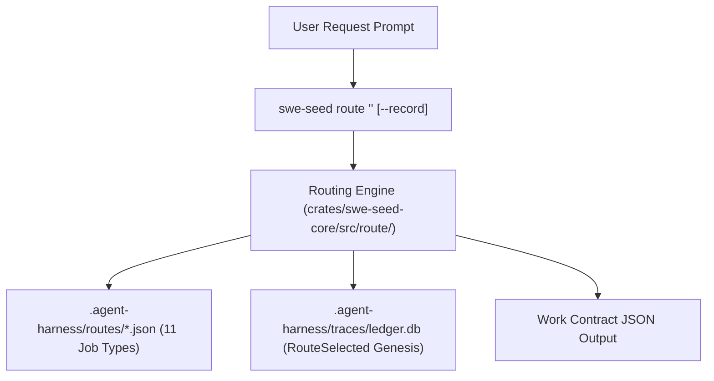
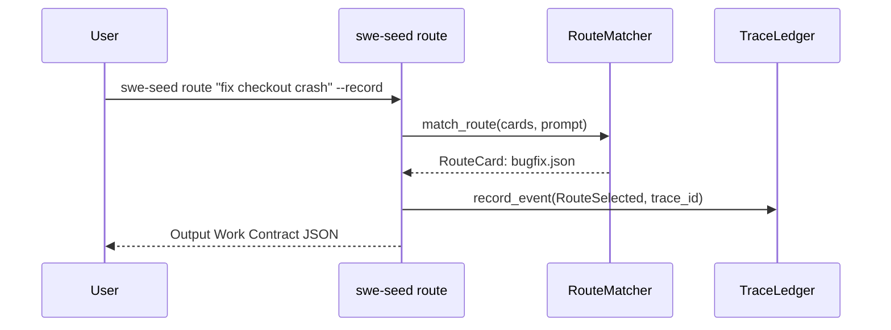

# Routing Engine Subsystem

The Routing Engine is the entry point for all task execution in SWE_SEED. It enforces the foundational operating rule: **Routing is mandatory.**

---

## 1. Purpose

The Routing Engine translates an unstructured user or agent prompt into a machine-readable, pre-declared Work Contract. By selecting a specific `RouteCard` before execution begins, it establishes bounded context, necessary skills, an ordered work loop, expected artifacts, and required proof commands, preventing agents from improvising procedures or grading their own work.

---

## 2. Responsibilities

- **Route Selection**: Matching input prompt text against the 11 canonical route cards residing in `.agent-harness/routes/`.
- **Work Contract Assembly**: Extracting required context files, skills, work stages, and proof commands for the selected job type.
- **Trace Genesis Recording**: Recording an immutable `RouteSelected` genesis event into the SQLite trace ledger when `--record` is passed.
- **Next Action Direction**: Providing concrete initial guidance to the calling agent to begin the task.

---

## 3. Non-Responsibilities

- **Does Not Modify Code**: The router produces a contract; it does not write or edit source code.
- **Does Not Execute Proof**: Proof execution is performed downstream by `just ci` or the agent.
- **Does Not Decide Merge Eligibility**: Verification of the resulting trace is performed by the Routing Gate.

---

## 4. Position in the System

- **Who calls it**: Human developers, host agents (`AGENTS.md` operating contract), and orchestration hooks.
- **What it calls**: Route card loaders in `.agent-harness/routes/`, token scoring algorithms, and the `trace_ledger` engine.

---

## 5. Core Abstractions

- `RouteCard`: Struct representing a loaded `.json` route card, with fields for `id`, `job_type`, `purpose`, `semantic_triggers`, `positive_examples`, `negative_examples`, `required_context`, `required_skills`, `work_loop`, `required_artifacts`, `proof`, `done_when`, and `failure_modes`.
- `RouteDecision`: Output structure containing the selected `job_type`, `route_card` path, `required_context`, `required_skills`, `work_loop`, `required_artifacts`, `proof`, `done_when`, and `next_action`.
- `match_route(cards, prompt)`: Matching function that scores route candidates against the input prompt.

---

## 6. Internal Operation

1. **Card Discovery**: The router scans `.agent-harness/routes/` and deserializes all JSON route cards.
2. **Scoring**:
   - Matches words in the prompt against `semantic_triggers`.
   - Computes text similarity against `positive_examples`.
   - Penalizes matches against `negative_examples`.
3. **Fallback Policy**: If no strong match emerges, it falls back to the default route card specified by policy or returns an explicit fallback instruction.
4. **Ledger Recording**: If invoked with `--record`, the engine opens `.agent-harness/traces/ledger.db`, records a `RouteSelected` event with timestamp and task hash, and initiates a cryptographic hash chain.

---

## 7. State

- **Owned State**: None directly (stateless matching logic).
- **Read State**: `.agent-harness/routes/*.json`.
- **Modified State**: When `--record` is passed, appends an event to `.agent-harness/traces/ledger.db`.

---

## 8. Lifecycle

---

## 9. Failure Modes

- **Misclassification**: Prompt ambiguity leads to selecting an unintended route. Resolved by providing explicit action verbs or adding negative examples to competing route cards.
- **Missing Route Card**: A required job type file is deleted from `.agent-harness/routes/`. Detected and blocked by `just harness-validate`.
- **Unrecorded Genesis**: Running without `--record` means the trace cannot pass `swe-seed gate <id> --verify`.

---

## 10. Extension Points

- **Adding a Route Card**: Create a new JSON file in `.agent-harness/routes/<new-id>.json`. It must validate against `RouteCard` schema and satisfy `harness_validate`.
- **Tuning Matching Weights**: Adjust `semantic_triggers` and examples in existing route cards without recompiling the binary.

---

## 11. Source Trail

- `crates/swe-seed-core/src/route/mod.rs`: `RouteCard`, `RouteDecision`, `match_route()`, `load_route_cards()`.
- `crates/swe-seed/src/cli.rs`: Command line dispatch for `Route` subcommand.
- `.agent-harness/routes/`: Canonical JSON definitions for all 11 job types.
- `.agent-harness/baml/baml_src/harness.baml`: Canonical schema contract.
- `crates/swe-seed/tests/route_golden.rs`: Golden fixture regression tests for routing.
