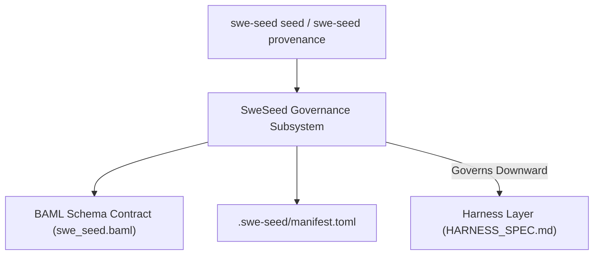
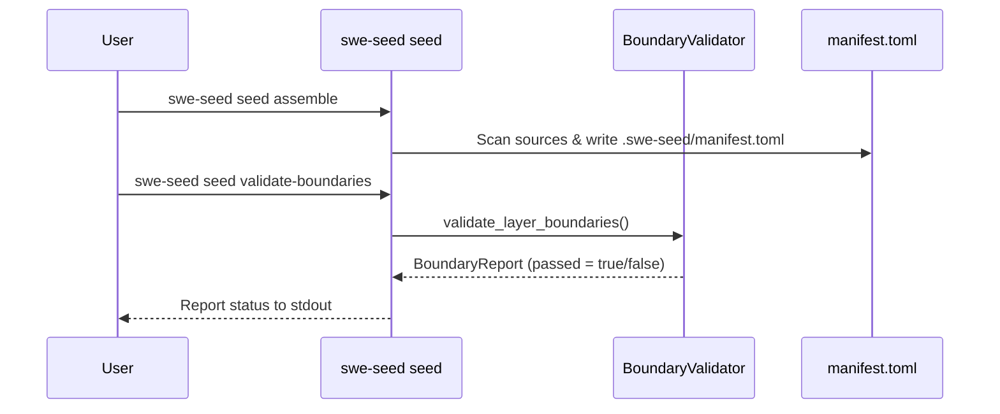

# SweSeed Governance Subsystem

The SweSeed Governance Subsystem is the outermost layer of the SWE_SEED stack. It governs capability registration, enforces downward layer boundary discipline, maintains SHA-256 provenance records, and plans idempotent regeneration.

---

## 1. Purpose

The SweSeed layer provides centralized governance for all capabilities (skills, MCP servers, hooks, rules, slash commands, and doctrine) across diverse coding tools. It prevents architectural erosion by ensuring that inner layers never govern outer concerns and guarantees that all governed artifacts maintain full provenance before release.

---

## 2. Responsibilities

- **Capability Assembly**: Assembling discrete `LayerCapability` entries into a unified `SeedPackageManifest` under `.swe-seed/manifest.toml`.
- **Layer Boundary Enforcement**: Evaluating layer relationships (`SweSeed` -> `Harness` -> `Fabricator`) and rejecting releases if an inner layer violates downward governance.
- **Provenance Verification**: Computing and validating cryptographic SHA-256 hashes and license classifications for all registered capabilities.
- **Idempotent Regeneration**: Computing deterministic `SeedRegenerationPlan` records so artifacts can be regenerated without side effects or unreviewed changes.

---

## 3. Non-Responsibilities

- **Not an LLM Gateway**: Does not handle model provider routing or streaming.
- **Not a Skill Pack**: Does not bundle domain-specific skills; it provides the governance plane to host them.
- **Not an Execution Runtime**: Does not run tests or execute coding tasks; that responsibility belongs to the Harness layer.

---

## 4. Position in the System

- **Who calls it**: The CLI commands `swe-seed seed assemble`, `swe-seed seed validate-boundaries`, `swe-seed seed regenerate`, and `swe-seed provenance verify`, as well as `swe-seed doctor`.
- **What it calls**: Filesystem discovery APIs, SHA-256 hashing routines, and BAML schema validators.

---

## 5. Core Abstractions

- `ProjectSeed`: Declares project identity, toolchain requirements, command contracts, and proof baselines.
- `LayerCapability`: A governed capability with assigned layer ownership (`LayerName`), source specification, and artifact metadata.
- `SeedPackageManifest`: The serialized inventory cataloging all capabilities, profiles, and sources.
- `BoundaryReport` / `BoundaryFinding`: The audit artifact produced by boundary validation.
- `ArtifactMetadata`: Provenance tracking containing author, hash, license, and review status.

---

## 6. Internal Operation

When `swe-seed seed validate-boundaries` runs:
1. `validate_layer_boundaries()` scans all registered capabilities.
2. It checks whether any inner layer capability references an outer layer asset or claims ownership of an outer concern.
3. It checks whether required specifications or artifacts are missing from disk.
4. If findings exist, it compiles a `BoundaryReport` with `passed = false` and prints each finding with remediation suggestions.
5. In `swe-seed doctor`, a failed boundary report marks the doctor check as failing.

---

## 7. State

- **Owned State**: `.swe-seed/manifest.toml`, `.swe-seed/provenance.json`.
- **Read State**: `docs/specs/`, `.agent-harness/baml/baml_src/swe_seed.baml`, all capability artifact paths.
- **Modified State**: Regeneration plans update target files idempotently.

---

## 8. Lifecycle

---

## 9. Failure Modes

- **Boundary Violation**: An inner layer artifact modifies an outer layer file. `validate_layer_boundaries()` outputs a `BoundaryFinding` and fails.
- **Missing Provenance Hash**: A capability in the manifest has an empty or mismatched SHA-256 hash. `swe-seed provenance verify` fails closed with exit code 1.
- **Unreviewed Promotion**: A capability marked with `review_required = true` is promoted without signed approval.

---

## 10. Extension Points

- **Registering a New Capability Type**: Add the variant to `LayerCapabilityKind` in `crates/swe-seed-core/src/seed/capability.rs` and update `swe_seed.baml`.
- **Adding Custom Boundary Rules**: Extend `validate_layer_boundaries()` in `crates/swe-seed-core/src/seed/boundary.rs`.

---

## 11. Source Trail

- `crates/swe-seed-core/src/seed/boundary.rs`: `validate_layer_boundaries()`, `BoundaryReport`.
- `crates/swe-seed-core/src/seed/capability.rs`: `LayerCapability`, `select_layer_capabilities()`.
- `crates/swe-seed-core/src/seed/manifest.rs`: `SeedPackageManifest`, `assemble_seed_package()`.
- `crates/swe-seed-core/src/seed/regenerate.rs`: `regenerate_seed_package()`, `SeedRegenerationPlan`.
- `crates/swe-seed-core/src/provenance/verify.rs`: `verify_provenance()`.
- `.agent-harness/baml/baml_src/swe_seed.baml`: Canonical BAML schema definitions.
- `docs/specs/0002-swe-seed-centralization-layer.md`: Architecture specification.
- `docs/specs/0018-layer-boundary-governance.md`: Boundary governance specification.
