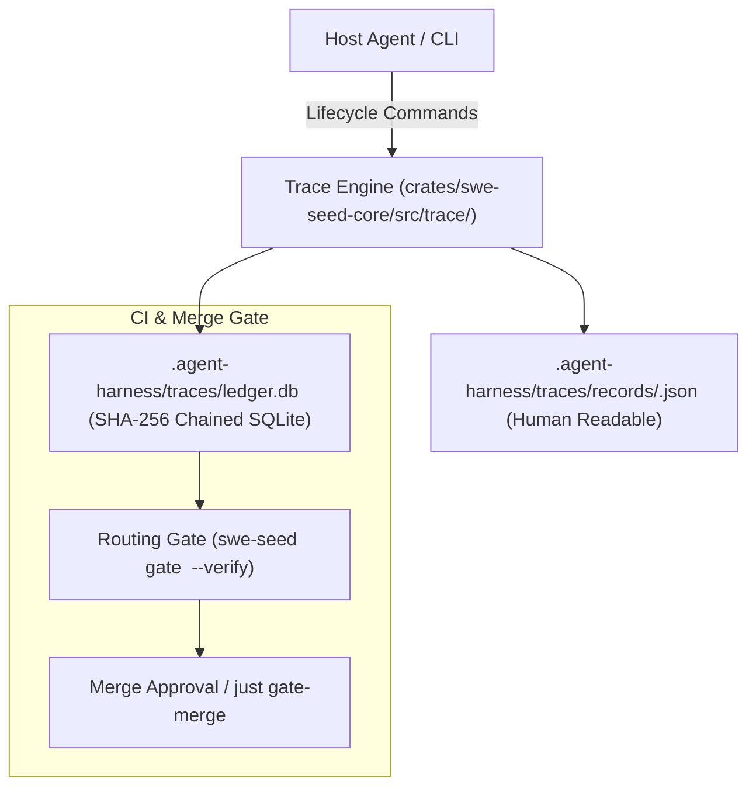
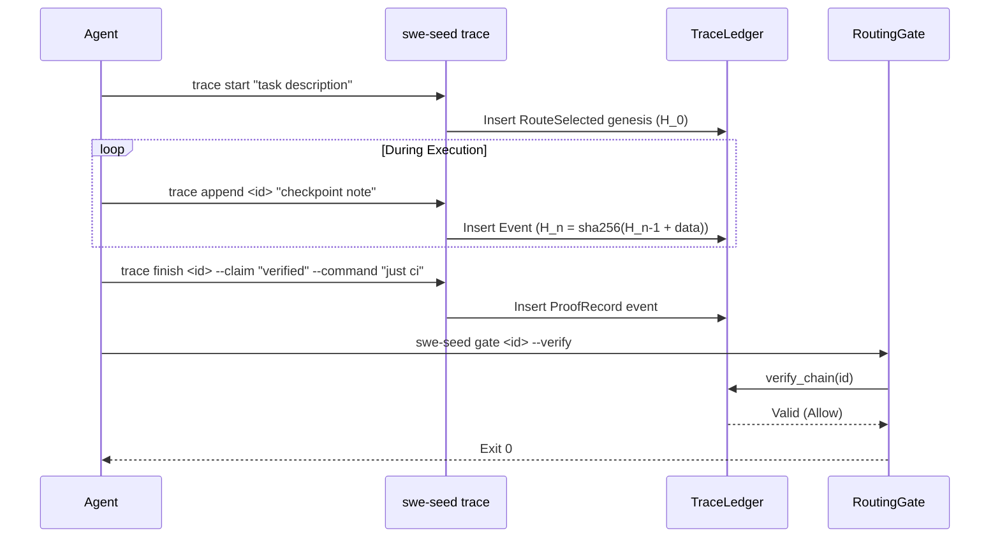

# Trace Ledger & Gate Subsystem

The Trace Ledger & Gate Subsystem provides durable, tamper-evident record keeping for all agent and developer activities, coupled with an enforcement gate that blocks unproven or unrouted changes from merging.

---

## 1. Purpose

Agent sessions are ephemeral: when a chat session terminates, the reasoning, tool calls, and completion claims vanish unless captured in structured form. The Trace Ledger records execution events into append-only JSON files and an SQLite database linked by cryptographic SHA-256 hash chains. The Routing Gate validates this chain to ensure that no code change merges without pre-bound routing and verified proof.

---

## 2. Responsibilities

- **Trace Lifecycle**: Managing the six discrete stages of execution: `start`, `append`, `checkpoint`, `resume`, `distill`, and `finish`.
- **Cryptographic Hash Chaining**: Computing and validating `sha256(previous_hash + current_event_payload)` for every recorded transition.
- **Routing Gate Enforcement**: Evaluating whether a trace originated from a valid `RouteSelected` genesis event and verifying chain integrity.
- **Durable Decisions**: Storing architectural decisions, route choices, and test outputs so successor agents can resume tasks immediately.

---

## 3. Non-Responsibilities

- **Not a Git Replacement**: Git tracks file diffs; the trace ledger tracks the rationale, routing contract, and verification claims behind those diffs.
- **Not a Cloud Telemetry Daemon**: State is kept purely in repository-local files and SQLite databases.

---

## 4. Position in the System

- **Who calls it**: `just harness-trace-*` recipes, `swe-seed trace`, `swe-seed gate`, and CI merge workflows.
- **What it calls**: `rusqlite` for database management and `sha2` for cryptographic hashing.

---

## 5. Core Abstractions

- `TraceRecord`: The serialized JSON document storing task metadata, route decisions, events, checkpoints, claims, and proof results.
- `TraceLedger`: The embedded SQLite interface maintaining the `events` table with columns for `event_id`, `trace_id`, `event_type`, `payload`, `prev_hash`, and `hash`.
- `RouteGate`: The evaluation enum returned by `route_gate()`:
  - `RouteGate::Allow`: Valid genesis exists and chain hashes match.
  - `RouteGate::Block(reason)`: Missing genesis, missing ledger, or hash mismatch.

---

## 6. Internal Operation

### 1. Hash Chaining
When `trace start` executes:
- An initial genesis event (`RouteSelected`) is created.
- The hash of the genesis event is computed: `H_0 = sha256("GENESIS" + payload)`.
- Subsequent events compute: `H_n = sha256(H_{n-1} + payload_n)`.
- Hashes are stored alongside payloads in `ledger.db`.

### 2. Gate Verification (`swe-seed gate <id> --verify`)
- Reads all events for `trace_id` in ascending sequence order.
- Asserts that event index 0 is a `RouteSelected` event.
- Iteratively recomputes hashes from index 0 to N, comparing computed hashes against stored hashes.
- If any byte of any payload was modified, or if an event was inserted/deleted, the gate fails immediately (`RouteGate::Block`), causing `just gate-merge` to exit with status 1.

---

## 7. State

- **Owned State**:
  - `.agent-harness/traces/records/<trace_id>.json`: Canonical JSON trace records.
  - `.agent-harness/traces/ledger.db`: Cryptographic ledger database.
  - `.agent-harness/traces/route-decisions/<trace_id>.json`: Standalone route decision records.
- **Read State**: None (self-contained).
- **Modified State**: Appends records during task execution.

---

## 8. Lifecycle

---

## 9. Failure Modes

- **Chain Tampering**: Manual edits to `records/<id>.json` or `ledger.db` invalidate the hash chain, causing `swe-seed gate` to fail closed.
- **Missing Genesis**: Creating a trace without selecting a route results in a `Block` status because routing is mandatory.
- **Unclosed Trace**: Attempting to gate a trace that has not received a `trace finish` command will be rejected for missing proof claims.

---

## 10. Extension Points

- **Custom Event Payloads**: Extend `TraceSchema` in `crates/swe-seed-core/src/trace/schema.rs` to support new structured event types.
- **Custom Gate Conditions**: Add additional verification rules to `crates/swe-seed-core/src/routing_gate.rs`.

---

## 11. Source Trail

- `crates/swe-seed-core/src/trace/lifecycle.rs`: Lifecycle implementations (`start`, `append`, `checkpoint`, `resume`, `distill`, `finish`).
- `crates/swe-seed-core/src/trace/record.rs`: `TraceRecord` struct and JSON serialization.
- `crates/swe-seed-core/src/trace_ledger.rs`: SQLite ledger, hash chaining, and `verify_chain()`.
- `crates/swe-seed-core/src/routing_gate.rs`: `route_gate()` logic.
- `crates/swe-seed/src/trace_cli.rs`: CLI command handlers.
- `crates/swe-seed/src/gate_cli.rs`: Gate CLI command handler.
- `docs/specs/0014-trace-and-durable-decisions.md`: Specification.
