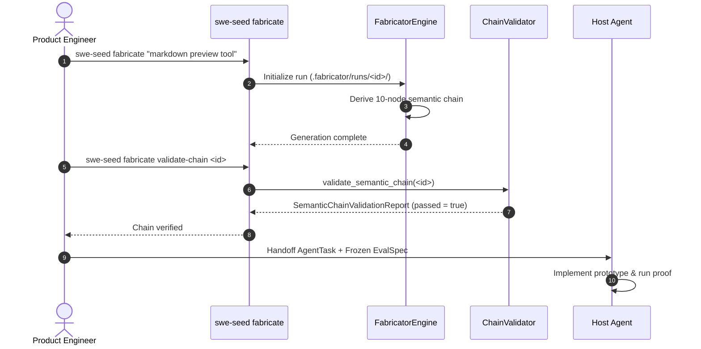

# Workflow: Fabricator Product Run

This document traces the step-by-step execution path of synthesizing a product need into a proven prototype through the Fabricator semantic chain.

---

## 1. Summary

The Fabricator workflow translates an informal product need into a working prototype via a single, bounded synthesis pass. It derives 10 interdependent specification artifacts, validates forward and backward traceability links, freezes an evaluation contract (`FabricatorEvalSpec`), hands off execution to an agent, executes proof commands, and records post-run learning.

---

## 2. Sequence

1. **Seed Creation**: Developer runs `swe-seed fabricate "Need description"` (or creates a seed under `.fabricator/seeds/`).
2. **Run Initialization**: A unique run directory is created under `.fabricator/runs/<run_id>/`.
3. **Chain Derivation**: The engine derives each artifact in order:
   `ProductSeed -> JobStory -> ProductHypothesis -> PRD -> ProductADR -> EARSRequirements -> SDS -> GherkinScenarios -> TDDPlan -> AgentTask`.
4. **Link Validation**: `swe-seed fabricate validate-chain <run_id>` verifies that every artifact includes a valid `TraceabilityLink` pointing to its predecessor.
5. **Agent Handoff**: The synthesized `AgentTask` is provided to the host coding agent alongside a frozen `FabricatorEvalSpec`.
6. **Prototype Execution & Proof**: The agent implements the prototype; verification commands (`just ci` or prototype test suite) execute.
7. **Run Reflection**: `swe-seed reflect <run_id>` captures lessons learned and updates the Fabricator catalog.

---

## 3. Detailed Path

- `crates/swe-seed/src/fabricate_cli.rs`: Command line parsing and run management.
- `crates/swe-seed-core/src/fabricator/artifacts.rs`: Artifact data models and serialization.
- `crates/swe-seed-core/src/fabricator/chain.rs`: `validate_semantic_chain()`.
- `crates/swe-seed-core/src/fabricator/render.rs`: Template generation routines.

---

## 4. State Changes

- **Run Storage**: Creates `.fabricator/runs/<run_id>/` containing all generated markdown specs (`JOB_STORY.md`, `PRD.md`, `SDS.md`, `TASK.md`, etc.).
- **Validation Report**: Writes `CHAIN_REPORT.json` containing link verification details.

---

## 5. Failure Branches

- **Broken Traceability Link**: If an artifact omits its parent hash or reference, `validate_semantic_chain()` sets `passed = false` and blocks task handoff.
- **Malformed EARS/Gherkin**: If requirements or scenarios violate syntax rules, chain validation fails with actionable error messages.

---

## 6. Sequence Diagram

---

## 7. Source Trail

- `crates/swe-seed-core/src/fabricator/artifacts.rs`: Artifact schemas.
- `crates/swe-seed-core/src/fabricator/chain.rs`: Chain validator.
- `crates/swe-seed/src/fabricate_cli.rs`: CLI commands.
- `FABRICATOR_SPEC_v0.1.0.md`: Root specification.
- `docs/specs/0017-fabricator-layer.md`: Detailed specification.
