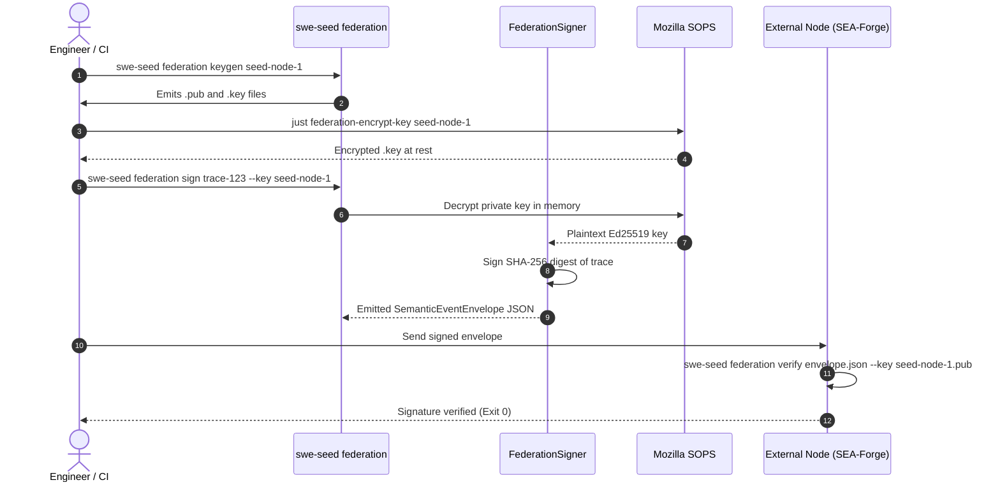

# Workflow: Federation Signing & Verification

This document traces the complete cryptographic lifecycle for managing Ed25519 federation keys, encrypting keys at rest with SOPS, signing trace envelopes, and verifying signatures.

---

## 1. Summary

When SWE_SEED participates in the SEA agentic capability loop, task execution traces are sealed into signed `SemanticEventEnvelope` payloads. This workflow covers key generation, SOPS-based encryption at rest, in-memory signing of trace digests, and cryptographic verification against committed public keys.

---

## 2. Sequence

1. **Key Generation**: Engineer runs `swe-seed federation keygen <key-id>`.
2. **Key Storage**:
   - The public key is saved to committed `.agent-harness/federation/keys/<key-id>.pub`.
   - The private key is saved to gitignored `.swe-seed/federation/keys/<key-id>.key`.
3. **SOPS Encryption**: Engineer runs `just federation-encrypt-key <key-id>`, encrypting the private key file at rest using Mozilla SOPS and age.
4. **Envelope Signing**: When a task completes, `swe-seed federation sign <trace-id> --key <key-id>` decrypts the private key into memory, computes the SHA-256 digest of the trace, and generates an Ed25519 digital signature.
5. **Envelope Packaging**: Wraps the signature and trace into a `SemanticEventEnvelope` JSON payload.
6. **Signature Verification**: A recipient node (or local test) executes `swe-seed federation verify <envelope-file> --key <key-id>`. The engine verifies the signature against the committed public key.

---

## 3. Detailed Path

- `crates/swe-seed/src/federation_cli.rs`: CLI commands (`keygen`, `sign`, `verify`, `status`).
- `crates/swe-seed-core/src/federation/signing.rs`: Ed25519 keypair generation, signing, and verification.
- `crates/swe-seed-core/src/federation/envelope.rs`: `SemanticEventEnvelope` schema and serialization.
- `justfile`: `federation-encrypt-key`, `federation-decrypt-key`.

---

## 4. State Changes

- **Key Directories**:
  - Writes public key to `.agent-harness/federation/keys/<key-id>.pub`.
  - Writes encrypted private key to `.swe-seed/federation/keys/<key-id>.key`.
- **Envelope Artifact**: Writes signed envelope JSON.

---

## 5. Failure Branches

- **Corrupted Payload**: If any byte in the envelope payload is altered after signing, `verify` exits with a cryptographic signature mismatch error.
- **Unencrypted Private Key**: If a private key file is detected on disk without SOPS encryption headers, `doctor` flags a critical security finding.

---

## 6. Sequence Diagram

---

## 7. Source Trail

- `crates/swe-seed-core/src/federation/signing.rs`: Keypair generation, signing, verification.
- `crates/swe-seed-core/src/federation/envelope.rs`: Envelope data models.
- `crates/swe-seed/src/federation_cli.rs`: Command handlers.
- `docs/specs/0011-sea-loop-federation.md`: Subsystem specification.
