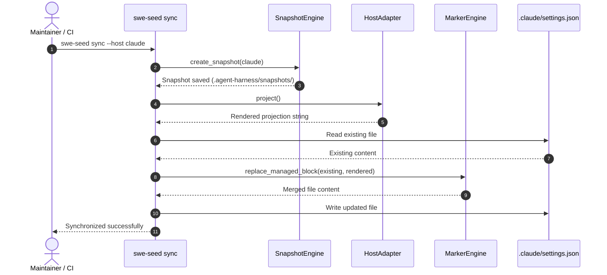

# Workflow: Host Projection & Sync

This document traces the complete lifecycle of projecting canonical SWE_SEED specifications into host-native tool files, auditing for drift, and executing snapshot rollbacks.

---

## 1. Summary

SWE_SEED maintains canonical rules, doctrine, and skills in version-controlled harness directories (`.agent-harness/`). To project these rules into multiple AI coding tools without overwriting user-specific configurations, the projection engine snapshots existing files, compiles canonical specs into host-native syntax, updates content strictly within managed block delimiters, and audits target files for manual drift.

---

## 2. Sequence

1. **Invocation**: User or automation executes `swe-seed sync --host <host>` (e.g. `claude`, `copilot`, `antigravity`).
2. **Snapshot Creation**: The engine backs up existing target files into `.agent-harness/snapshots/<host>/<timestamp>/`.
3. **Template Compilation**: The adapter loads canonical doctrine (`AGENTS.md`), memory files, and skills, rendering them into the host's expected format.
4. **Managed Block Replacement**:
   - Locates `<!-- BEGIN SWE_SEED MANAGED BLOCK -->` and `<!-- END SWE_SEED MANAGED BLOCK -->`.
   - Preserves all lines before the begin marker and after the end marker.
   - Replaces all lines between the markers with the freshly rendered content.
5. **Disk Write**: The updated file is written back to disk.
6. **Drift Audit**: Running `swe-seed doctor --host <host>` compares the disk content against a freshly computed in-memory projection.
7. **Rollback (Optional)**: If changes need to be reversed, `swe-seed rollback --host <host>` restores the latest snapshot.

---

## 3. Detailed Path

- `crates/swe-seed/src/host_cli.rs`: `run_sync()`, `run_rollback()`.
- `crates/swe-seed-core/src/adapters/mod.rs`: `sync()`, `rollback()`.
- `crates/swe-seed-core/src/adapters/snapshot.rs`: `create_snapshot()`, `restore_latest_snapshot()`.
- `crates/swe-seed-core/src/adapters/marker.rs`: `replace_managed_block()`.
- Specific adapter files: `claude.rs`, `github_copilot.rs`, `antigravity.rs`.

---

## 4. State Changes

- **Snapshot Storage**: Appends backup directory under `.agent-harness/snapshots/<host>/<timestamp>/`.
- **Target Files**: Modifies bounded sections in target files (e.g. `.claude/settings.json`, `.github/copilot-instructions.md`).

---

## 5. Failure Branches

- **Missing Managed Markers**: If target file exists but lacks managed block comments, `sync` halts with an error to prevent overwriting unmanaged user content.
- **Drift Detected in Doctor**: If manual edits occur inside managed blocks, `swe-seed doctor` flags the file as drifted until resynchronized.

---

## 6. Sequence Diagram

---

## 7. Source Trail

- `crates/swe-seed-core/src/adapters/mod.rs`: `sync()`, `rollback()`.
- `crates/swe-seed-core/src/adapters/snapshot.rs`: Snapshot management.
- `crates/swe-seed-core/src/adapters/marker.rs`: Managed block marker logic.
- `crates/swe-seed/src/host_cli.rs`: CLI command handlers.
- `docs/specs/0004-host-adapter-contract.md`: Host adapter specification.
