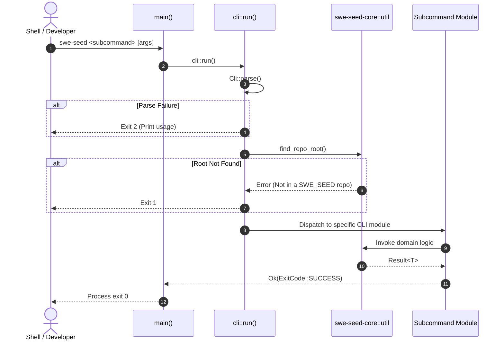

# Workflow: Startup & Discovery

This document traces the startup and workspace discovery lifecycle of the `swe-seed` CLI from invocation to execution dispatch.

---

## 1. Summary

When `swe-seed` is invoked, it parses arguments via `clap`, discovers the repository root by locating canonical boundary markers (`SWE_SEED_SPEC_v0.2.0.md` or `.agent-harness/`), initializes core environment settings, and routes the subcommand to the appropriate domain module in `swe-seed-core`.

---

## 2. Sequence

1. **Invocation**: OS launches `target/release/swe-seed` with command-line arguments.
2. **Schema Parsing**: `crates/swe-seed/src/cli.rs` parses the argument stream into the `Cli` struct.
3. **Workspace Discovery**: Root path resolution scans upward from the current working directory to locate the repository root.
4. **Subcommand Dispatch**: The parsed subcommand enum variant dispatches execution to its dedicated CLI module (`route`, `trace`, `seed`, `fabricate`, `gateway`, etc.).
5. **Core Execution**: The CLI module invokes the corresponding library functions in `crates/swe-seed-core`.
6. **Exit Code Mapping**: Result types are converted into process exit codes (0 for success, 1 for domain failure, 2 for CLI parse failure).

---

## 3. Detailed Path

- `crates/swe-seed/src/main.rs`: `main()` calls `cli::run()`.
- `crates/swe-seed/src/cli.rs`: `Cli::parse()`, match on `Command` enum.
- `crates/swe-seed-core/src/util.rs`: `find_repo_root()` verifies presence of root specs.
- Command-specific dispatch: e.g. `crates/swe-seed/src/seed_cli.rs`, `doctor_cli.rs`.

---

## 4. State Changes

- **In-Memory**: Parses configuration into runtime memory.
- **Filesystem**: Read-only during discovery phase; no filesystem state is modified until a mutating subcommand executes.

---

## 5. Failure Branches

- **Unrecognized Arguments**: `clap` prints usage instructions and exits with code 2.
- **Missing Repository Root**: If invoked outside a SWE_SEED repository, `find_repo_root()` returns an error indicating that no harness root could be detected.

---

## 6. Sequence Diagram

---

## 7. Source Trail

- `crates/swe-seed/src/main.rs`: `main()`.
- `crates/swe-seed/src/cli.rs`: `Cli`, `Command`, `run()`.
- `crates/swe-seed-core/src/util.rs`: Path utilities and workspace discovery.
