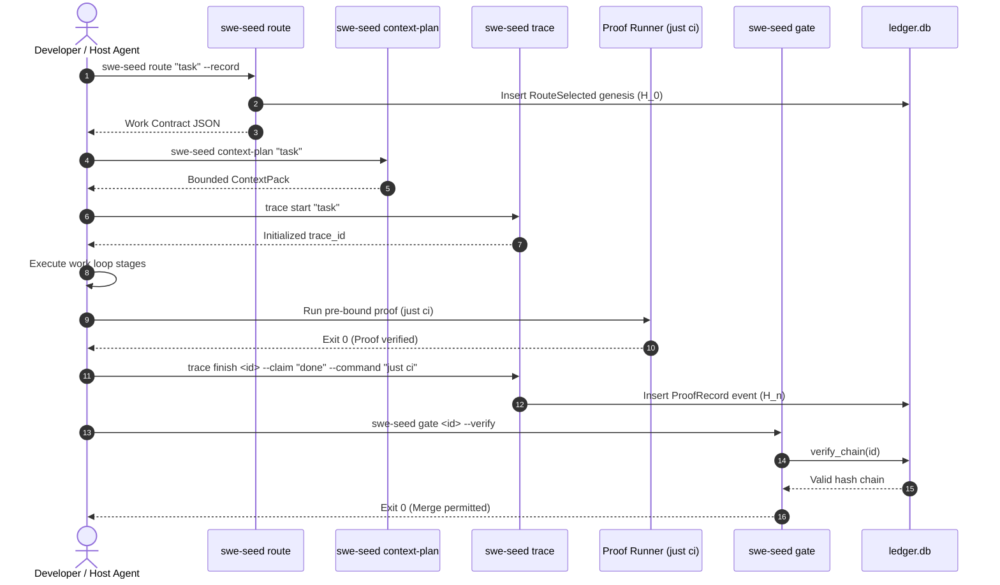

# Workflow: Task Routing to Proof

This document traces the complete execution lifecycle of a coding task under SWE_SEED governance, from initial intent routing to proof verification and gate closure.

---

## 1. Summary

Every material engineering change follows a closed verification loop: the task is routed to an explicit RouteCard, bounded context is computed to constrain intake, a cryptographic trace is initialized, work is performed according to the card's work loop, pre-bound proof commands are executed, the trace is finalized with command evidence, and the routing gate confirms ledger integrity before merging.

---

## 2. Sequence

1. **Routing**: Developer or agent runs `swe-seed route "<task>" --record`. The semantic router selects a RouteCard and writes a `RouteSelected` genesis entry into `.agent-harness/traces/ledger.db`.
2. **Context Planning**: `swe-seed context-plan "<task>"` outputs the bounded context files required for the task.
3. **Trace Initialization**: `swe-seed trace start "<task>"` creates `.agent-harness/traces/records/<trace_id>.json`.
4. **Execution Iterations**: The agent reads the context files and performs edits. Key milestones are recorded via `swe-seed trace checkpoint <trace_id> <stage> 
`.
5. **Proof Execution**: The agent executes the pre-bound proof command (`just ci`).
6. **Trace Closure**: `swe-seed trace finish <trace_id> --claim "
" --command "just ci" --result "pass"` appends the proof record and seals the trace.
7. **Gate Verification**: `swe-seed gate <trace_id> --verify` recomputes the SHA-256 hash chain and confirms the routing genesis. If valid, exits 0.

---

## 3. Detailed Path

- `crates/swe-seed-core/src/route/mod.rs`: `match_route()`, `load_route_cards()`.
- `crates/swe-seed-core/src/context/pack.rs`: `plan_context()`.
- `crates/swe-seed-core/src/trace/lifecycle.rs`: `trace_start()`, `trace_finish()`.
- `crates/swe-seed-core/src/trace_ledger.rs`: `record_event()`, `verify_chain()`.
- `crates/swe-seed-core/src/routing_gate.rs`: `route_gate()`.

---

## 4. State Changes

- **Trace Record**: Creates `.agent-harness/traces/records/<trace_id>.json` containing task description, checkpoints, and proof record.
- **Trace Ledger**: Inserts rows into `.agent-harness/traces/ledger.db`, chaining SHA-256 hashes from genesis to completion.
- **Repository Source**: Target code files are modified by the agent to satisfy the task.

---

## 5. Failure Branches

- **Failing Proof**: `just ci` exits non-zero. The agent cannot claim completion; the trace remains open or is finished with `result = "fail"`.
- **Bypassed Routing**: Modifying code without recording a route results in no `RouteSelected` genesis in the ledger. `swe-seed gate` fails closed.
- **Hash Chain Mismatch**: Tampering with trace files breaks the SHA-256 chain; `verify_chain()` returns an error.

---

## 6. Sequence Diagram

---

## 7. Source Trail

- `crates/swe-seed-core/src/route/mod.rs`: Routing logic.
- `crates/swe-seed-core/src/trace/lifecycle.rs`: Trace state transitions.
- `crates/swe-seed-core/src/trace_ledger.rs`: Ledger persistence and hash chaining.
- `crates/swe-seed-core/src/routing_gate.rs`: `route_gate()` verification.
- `justfile`: `harness-route`, `harness-trace-*`, `gate-merge` recipes.
